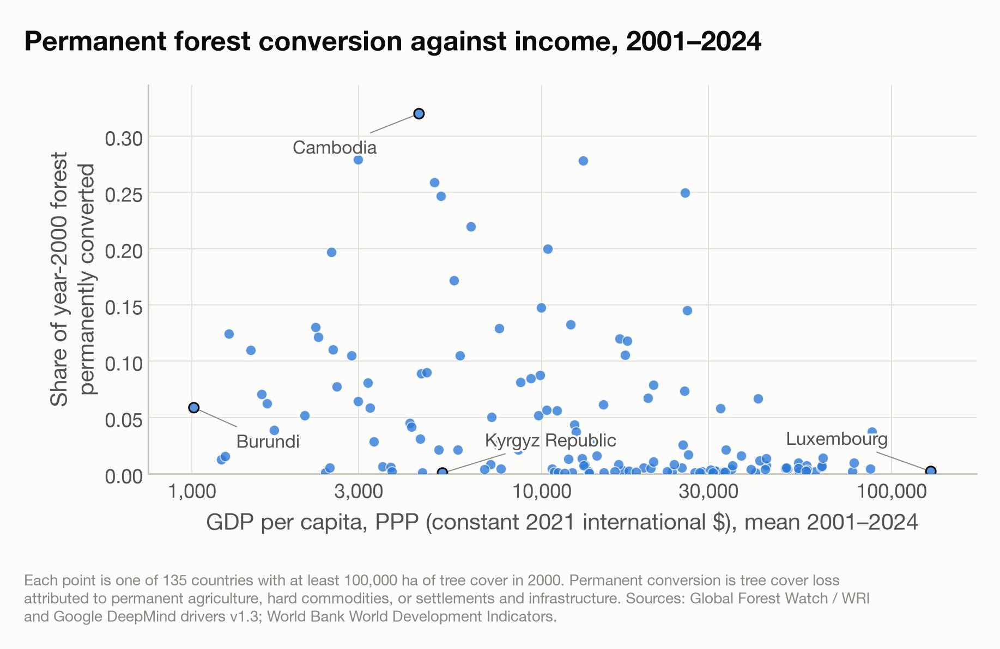
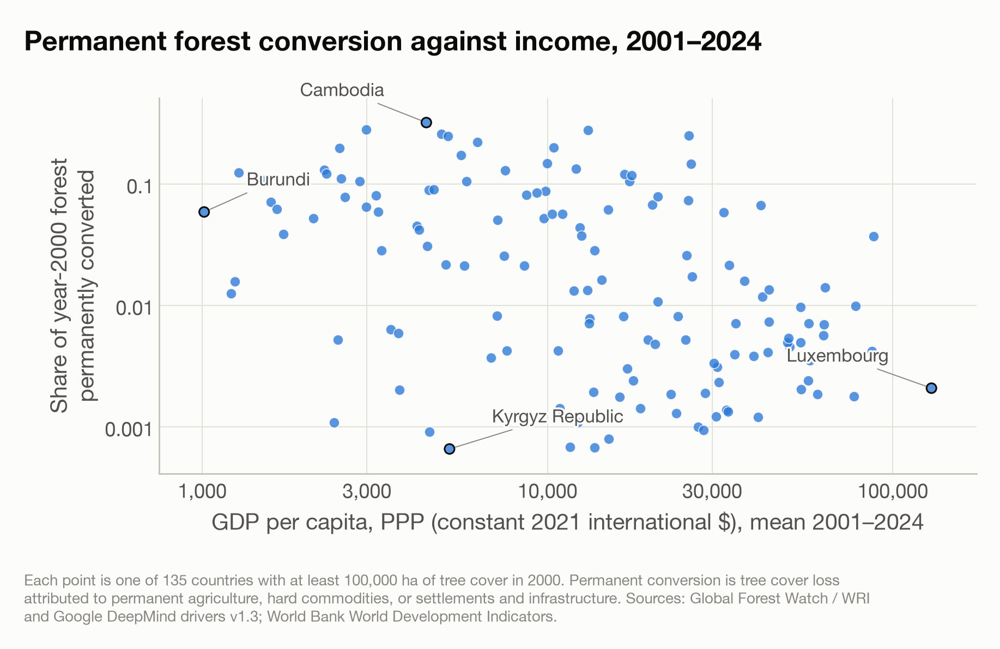
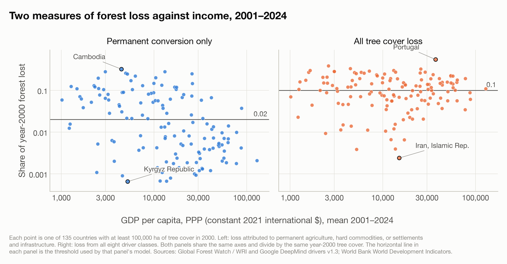

# Appendix

*The running record. Filled from the first step, not at the end. Everything that does not belong in the report belongs here: the workings, the diagnostics, the decisions and what each one cost.*

## Data Summary

The analysis uses one dataset, `Code/outputs/analysis_dataset.csv`: 135 countries, one row each, covering 2001–2024. It is built by `Code/07_build_analysis_dataset.py` from four source files in `Attachments/`, and every later script reads it rather than the sources, so the sample is defined in exactly one place.

### The analysis dataset

| Column | Unit | What it is |
| --- | --- | --- |
| `iso3` | ISO 3166-1 alpha-3 | Country identifier |
| `country` | — | Country name, from World Bank metadata |
| `income_group` | Four categories | World Bank income classification, **current vintage, not the classification during the period**. Used only to select the eight cases for sub-question 3. |
| `extent_2000_ha` | Hectares | Tree cover in 2000 at ≥30 percent canopy density. The denominator for both outcomes. |
| `permanent_loss_ha` | Hectares | Loss 2001–2024 attributed to permanent agriculture, hard commodities, or settlements and infrastructure |
| `shifting_loss_ha` | Hectares | Loss 2001–2024 attributed to shifting cultivation. Held for the sensitivity check only. |
| `total_loss_ha` | Hectares | Loss 2001–2024, all eight driver classes |
| `permanent_loss_share` | Proportion | `permanent_loss_ha / extent_2000_ha`. **Outcome for sub-question 1.** |
| `total_loss_share` | Proportion | `total_loss_ha / extent_2000_ha`. **Outcome for sub-question 2.** |
| `permanent_plus_shifting_share` | Proportion | Outcome for the sensitivity check on sub-question 1 |
| `gdp_pc_mean` | Constant 2021 international $, PPP | Arithmetic mean of GDP per capita over 2001–2024. **Predictor for both sub-questions.** |
| `gdp_pc_geomean` | Same | Geometric mean, held as a robustness check |
| `log_gdp_pc_mean` | Natural log | `log(gdp_pc_mean)` |
| `gdp_years_used` | Count | Years of GDP data behind the mean, out of 24 |

### Sample rule

A country enters if it has at least 100,000 ha of tree cover in 2000, is a non-aggregate country in the World Bank metadata, and has at least one GDP observation in 2001–2024. Of the 183 countries meeting the last two conditions, 135 clear the forest floor.

| Income group | Countries |
| --- | --- |
| Low income | 15 |
| Lower middle income | 36 |
| Upper middle income | 40 |
| High income | 44 |

### The variables as built

| Variable | Min | Median | Mean | Max |
| --- | --- | --- | --- | --- |
| `permanent_loss_share` | 0.0007 | 0.0134 | 0.0485 | 0.3198 |
| `total_loss_share` | 0.0024 | 0.1057 | 0.1254 | 0.5442 |
| `permanent_plus_shifting_share` | 0.0007 | 0.0213 | 0.0647 | 0.3857 |
| `gdp_pc_mean` | 1,013 | 13,263 | 21,546 | 129,432 |
| `log_gdp_pc_mean` | 6.921 | 9.493 | 9.435 | 11.771 |

Integrity checks, all run by the build script: no share falls outside [0, 1]; permanent loss never exceeds total loss; no missing value in any column used; one country has fewer than 24 years of GDP behind its mean. The arithmetic and geometric means of income rank countries at Spearman 0.999629 and differ by at most 19.4 percent, so the choice between them is immaterial.

### Provenance

| File | Source | Retrieved | SHA-256 |
| --- | --- | --- | --- |
| `gfw_tree_cover_loss_by_driver.csv` | Global Forest Watch Data API, `gadm__tcl__iso_change`, version `v20260424` | 2026-09-25 | `d0ca30c24536fa37c9f85a36a949c9c0572be33309fbd3d2671113cdea51f5b1` |
| `gfw_tree_cover_extent_2000.csv` | Global Forest Watch Data API, `gadm__tcl__iso_summary`, version `v20260424` | 2026-09-25 | `71efdbf254b637b92028c62109b1e172e182b801fa994492f6a275a68628fed0` |
| `worldbank_gdp_per_capita_ppp.csv` | World Bank WDI, `NY.GDP.PCAP.PP.KD`, series updated 2026-07-13 | 2026-09-25 | `0aaa80593d77a3b3ddcc61e825e5eb7ce52cf58f51fce6e2b502907dd9b82f1c` |
| `worldbank_country_metadata.csv` | World Bank country list, region and income group | 2026-09-25 | `028b150152824119404b4a30094d3c79c74fe29897abfa015532b720d31844d4` |

**Why this form of the forest data.** The FAO Forest Resources Assessment series, reached through FAOSTAT, the World Bank or Our World in Data, was rejected: countries report only every five years and FAO fills the intervening years by linear interpolation, so annual change is mostly the shape of the interpolation rather than a measured change. Our World in Data's published file gives Afghanistan's 1991 change as exactly zero. It is also net, so planting in one place cancels clearing in another. The headline Global Forest Watch loss series was rejected as the sole measure because it counts logging rotation, wildfire and plantation harvest alongside permanent clearing; the driver-disaggregated form separates them, and both the disaggregated and the headline totals are used, for sub-questions 1 and 2 respectively.

**Why version `v20260424`.** The API's `latest` alias resolves to `v20250515`, which stops at 2024 and carries the older six-class Curtis et al. (2018) taxonomy. Version `v20260424` is served at the same endpoint without being flagged: it runs to 2025 and carries the eight-class WRI/Google taxonomy. The two agree to the hectare on every overlapping year — Brazilian primary forest at the 30 percent threshold gives 1,772,215 ha for 2022, 1,136,251 for 2023 and 2,823,647 for 2024 in both — and the 2024 figure matches the 2.8 Mha Global Forest Watch published. It is the same loss data with a richer classification, not a revision.

**Corroboration against the publisher.** Permanent agriculture, hard commodities, and settlements and infrastructure over 2001–2024 across all countries total 176.1 Mha, 34.1 percent of all tree cover loss, with permanent agriculture 94.6 percent of that. The World Resources Institute publishes 177 Mha, 34 percent and 95 percent for the same quantity, so the extraction and the driver scoping agree with the publisher to within half a percent.

### Units and what is a measurement

`tree_cover_loss_ha` and `extent_2000_ha` are **remotely sensed classifications**, not ground measurements: Landsat imagery at roughly 30 m, classified as stand-replacement disturbance by the algorithm of Hansen et al. (2013). The `driver` label is a **model output** — a ResNet trained on visually interpreted high-resolution imagery, assigning one dominant driver per 1 km cell for the whole 2001–2025 period. `gdp_pc_mean` is **partly a model output**: PPP conversion factors come from International Comparison Program benchmark surveys in benchmark years and are extrapolated to the rest.

Two consequences follow, and both belong in `Methods`. First, `permanent_loss_share` depends on the driver classifier while `total_loss_share` does not, since the latter sums over every class. Second, the Global Forest Change product stores one loss year per pixel, so a pixel lost, regrown and lost again is counted once; the outcomes are therefore the share of year-2000 forest disturbed **at least once**, and repeat disturbance in fast-rotation plantations — which sit in richer countries — is undercounted. This second point is a property of the published raster, not a claim in Hansen et al. (2013); the paper states only that 0.2 Mkm² of land "experienced both loss and subsequent gain in forest cover during the study period" and says nothing about a second loss on the same pixel. It was attributed to the paper before the paper had been read, and the attribution is corrected here. The empirical check at log row 19 stands on its own.

**What the Hansen source text establishes.** Three claims our documents make are confirmed verbatim. Loss is a stand-replacement disturbance: "Forest loss was defined as a stand-replacement disturbance and disaggregated by reference percent tree cover stratum". The resolution is Landsat at 30 m: the study area totals "the equivalent of 143 billion 30m Landsat pixels". Trees are a height class, not a land use: "trees were defined as all vegetation taller than 5m in height".

Two further statements in the text bear on this analysis and were not previously recorded.

**Degradation short of stand replacement is absent from the data entirely.** "Forest degradation, for example selective removals from within forested stands that do not lead to a non-forest state, was not included in the change characterization." Both our outcomes are therefore measures of stand-replacing disturbance, and sub-question 2's "all tree cover loss, however caused" means all loss the product records rather than all degradation. Selective logging that leaves the stand standing is invisible to both outcomes.

**The year of loss is derived, not observed.** "Forest loss was disaggregated to annual time scales using a set of heuristics derived from the maximum annual decline in percent tree cover and the maximum annual decline in minimum growing season Normalized Vegetation Difference Index (NDVI)." The loss total over a window is a classification; its allocation to a particular year within that window is a heuristic on top of it. This does not affect sub-questions 1 and 2, which use the 24-year cumulative total, but it falls directly on sub-question 3, which fits a trend to annual rates. It belongs in `Methods` beside that trend.

### Source columns present but not used

`natural_forest_class` is Unknown for 43 percent of loss hectares, too much to build an outcome on. `is_primary_forest` would have cut most of Europe from the sample, and the driver split already isolates permanent conversion. `area_ha` is unused because the denominator is a country's own forest rather than its territory. `region` is unused. All four remain in `Attachments/`.

### What the loss data contains

Loss over the analysis window 2001–2024, all countries, totals 517,279,499 ha. Sub-question 1 takes the first three classes; sub-question 2 takes all eight. Both divide by the same denominator, `extent_2000_ha`.

| Driver | Mha, 2001–2024 | Share | In sub-question 1 | In sub-question 2 |
| --- | --- | --- | --- | --- |
| Permanent agriculture | 166.6 | 32.2% | yes | yes |
| Hard commodities | 4.9 | 0.9% | yes | yes |
| Settlements & Infrastructure | 4.7 | 0.9% | yes | yes |
| Wildfire | 151.6 | 29.3% | no | yes |
| Logging | 129.5 | 25.0% | no | yes |
| Shifting cultivation | 50.2 | 9.7% | no | yes |
| Other natural disturbances | 8.0 | 1.5% | no | yes |
| Unknown | 1.8 | 0.4% | no | yes |
| **Sub-question 1 numerator** | **176.1** | **34.1%** | | |
| **Sub-question 2 numerator** | **517.3** | **100%** | | |

Driver attribution is near-complete: 0.4 percent of hectares are Unknown.

The two outcomes are not a rescaling of each other. `permanent_loss_share` is at or below `total_loss_share` for every country by construction, the median ratio between them is 0.207, and they rank the 135 countries at Spearman 0.533. Portugal is the widest divergence, at 0.0159 against 0.5442, because almost all its tree cover loss is eucalyptus rotation and fire; Cambodia is the narrowest, at 0.3198 against 0.3309, because almost all of its loss was permanent clearing.

**Driver definitions.** All seven are quoted verbatim below from the publisher's record for version 1.3 of the drivers product (World Resources Institute and Google DeepMind, 2026), which is the version covering 2001–2025 and so the one behind our loss file. The wording in the peer-reviewed methods paper (Sims et al., 2025) is an abbreviation of the same definitions and does not disagree with them.

| Driver | Publisher's definition, verbatim |
| --- | --- |
| Permanent agriculture | "Long-term, permanent tree cover loss for small- to large-scale agriculture. This includes perennial tree crops such as oil palm, cacao, orchards, nut trees, and rubber, as well as pasture and seasonal crops and cropping systems, which may include a fallow period. Agricultural activities are considered 'permanent' if there is visible evidence that they persist following the tree cover loss event and are not a part of a temporary cultivation cycle. Clearing land for agricultural activities may involve use of fire." |
| Hard commodities | "Tree cover loss due to the establishment or expansion of mining or energy infrastructure. Mining activities range from small-scale and artisanal mining to large-scale mining." |
| Settlements and infrastructure | "Tree cover loss due to expansion and intensification of roads, settlements, urban areas, or built infrastructure (not associated with other classes)." |
| Shifting cultivation | "Tree cover loss due to small- to medium-scale clearing for temporary cultivation that is later abandoned and followed by subsequent regrowth of secondary forest or vegetation." |
| Logging | "Forest management and logging activities occurring within managed, natural or semi-natural forests and plantations, often with evidence of forest regrowth or planting in subsequent years. This includes harvesting in wood-fiber plantations, clear-cut and selective logging, establishment of logging roads, and other forest management activities such as forest thinning and salvage or sanitation logging." |
| Wildfire | "Tree cover loss due to fire with no visible human conversion or agricultural activity afterward. Fires may be started by natural causes (e.g. lightning) or may be related to human activities (accidental or deliberate)." |
| Other natural disturbances | "Tree cover loss due to other non-fire natural disturbances, including storms, flooding, landslides, drought, windthrow, lava flows, sediment flow or meandering rivers." |

Three of these bear directly on the scoping. Permanent agriculture requires visible evidence that cultivation persists after the loss, which is what separates it from shifting cultivation; the distinction is the classifier's judgement about persistence, not a different kind of observation. Logging explicitly includes plantation harvest and clear-cutting, so it is forestry rotation rather than degradation of standing natural forest. Wildfire covers fires however they start, including deliberate human burning, provided no conversion follows — so a fire set to clear land for farming is classified as permanent agriculture rather than wildfire, which is the correction already recorded at log row 17.

**The `Unknown` class is not defined by the publisher.** It carries 1.8 Mha, 0.4 percent of loss in our window, and appears in the country-level aggregation served by the Global Forest Watch API. It is in none of the publisher's documentation: the Zenodo record, the Earth Engine catalogue entry and Sims et al. (2025) all describe seven classes and no eighth. The one documented mechanism that could produce unattributed loss is the sampling threshold — the paper states that "The 1 km grid cells, which contained tree cover loss that comprised at least 0.5% of the cell, were included as candidates for training data sampling", applied "to avoid sampling noise and due to the challenges of making accurate predictions on these small areas of loss" — but no source states that sub-threshold cells are what `Unknown` contains, and this is not asserted here. It remains an undocumented residual, retained as published. It affects sub-question 2 only, where it is one of the eight classes summed; it is outside the sub-question 1 numerator.

### What the sample excludes, and what that costs

**The forest floor removes 67 countries and 0.02 percent of global forest loss.** Without it the rate measure is dominated by artefacts: Mauritania's entire tree cover in 2000 is 33.3 ha, of which 33.2 ha was lost, a rate of 99.8 percent; Burkina Faso's is 130.3 ha, Eritrea's 4.6 ha, Niger's 2.3 ha. At a 30 m classification these are rounding effects. The countries excluded have almost no forest to lose, so the cost in the quantity being studied is near zero. The cost in coverage is not: the sample is a sample of forested countries, and any finding is a finding about forested countries rather than countries in general. A 10,000 ha floor (180 countries) and no floor with extent-weighted observations were both considered and not taken.

**Six forested countries are lost to missing GDP, not to the floor:** Venezuela, Cuba, North Korea, Eritrea, South Sudan and Taiwan. The World Bank publishes no PPP GDP for them. Venezuela and South Sudan in particular have meaningful forest loss, and their absence is a gap in the sample rather than a tidying-up. A further 27 codes with loss but no GDP are dependencies and territories with no separate GDP, or the GFW API's own non-country codes.

**2025 is excluded.** The release is five months old, its conversion total is the lowest since 2003, and World Bank GDP for 2025 is provisional. Including it moves the mean cumulative share from 0.0453 to 0.0473 and reorders the sample at Spearman 0.9997.

### Accepted as-is

The `Unknown` driver class, 0.3 percent of hectares, is retained as published rather than dropped or reassigned. Loss is gross: tree cover gain is not subtracted, so forest lost and regrown still counts as lost, and no annual gain layer exists to correct it. Income group is the current World Bank vintage applied to a period ending in 2024, which is acceptable because it is used only to select cases and never as an analysis variable.

## Research Question

### Discussion

The framing is the environmental Kuznets curve: the proposition that environmental damage rises with income while a country is industrialising and falls once it is rich enough to afford something cleaner. Applied to forests it implies that the poorest countries clear little, middle-income countries clear most, and the richest clear least. We test that shape across 135 countries, and then test it again with a broader measure of degradation.

**The outcome is measured as a cumulative share, not an annual rate.** For each country we take the forest permanently converted between 2001 and 2024 and divide it by the tree cover that country had in 2000. Income is the arithmetic mean of GDP per capita over the same years. This is a cross-section: one row per country, no time dimension.

**Two outcomes are used, and the pair is the point.** Sub-question 1 counts only permanent conversion, which depends on a classification model assigning a driver to each loss. Sub-question 2 counts all tree cover loss, which is the raw satellite record and does not depend on that model at all. Running the same specification on both shows whether the answer survives a broader definition of degradation, and whether it depends on trusting the driver classifier.

**Shifting cultivation is excluded from the headline outcome.** It is 9.8 percent of all loss and is temporary clearing that regrows, so it is not permanent loss. It is also concentrated in low-income countries, which is the rising limb of the curve, so the exclusion is not neutral. Sub-question 1 will be re-run with it included and the check reported here.

Four limitations are known before any result exists, and each belongs in `Methods` beside the number it qualifies.

**The resource is bounded.** A country cannot clear more forest than it has. Once remaining forest is small the loss rate is mechanically small, so a falling right-hand limb is exactly what would be produced by rich countries having completed their deforestation before the data begins — the forest transition described by Mather and Needle (1998). No specification separates "grew richer and chose to conserve" from "ran out of forest to clear".

**Income contains part of the outcome.** Clearing forest for agriculture and timber contributes to GDP, so the period-mean predictor is partly caused by the thing it is predicting. The relationship is an association, not a causal estimate.

**Driver labels are coarser than the loss they label.** The dominant driver is one label per 1 km cell for the whole 2001–2025 period, while loss is recorded at roughly 30 m and by year. The publisher states the product "does not show multiple drivers if they occur in the same cell at smaller scales, nor does it detail the sequence of drivers if multiple occurred at different times within the period." This affects sub-question 1 and not sub-question 2.

**Repeat disturbance is undercounted, and the bias has a direction.** Hansen stores one loss year per pixel, so forest lost, regrown and lost again counts once. Both outcomes are therefore the share of year-2000 forest disturbed at least once, not a count of disturbance events. Repeat disturbance inside a 24-year window happens in fast-rotation plantation forestry, which sits in richer countries, so degradation is understated at the rich end and the right-hand limb will fall more steeply than the truth. Its direction favours the hypothesis being tested. Nothing is double-counted: numerator and denominator are drawn from the same year-2000 pixel set, and in the data the highest cumulative total-loss share is Portugal at 0.544, with no country above 0.60. Portugal is the sharpest test available, since eucalyptus rotates on roughly ten to twelve years and a stand could be cut twice inside the window.

**The statistical method is not settled here.** Step 2 fixes what is being asked and what would count as an answer; the estimator, the functional form and the test belong to step 4. The outcome is a proportion bounded at zero and one, with skew 2.10 raw and −0.02 in logs, and that will bear on the choice when it is made.

**The outcome was changed to a threshold at step 4, and this is a change to what step 2 fixed.** Sub-questions 1 and 2 originally asked about the level of the continuous loss share. At the user's direction they now ask whether a country lies above a threshold, and the model of that is the headline rather than a robustness check. The reasoning is recorded in the `Analysis Log`; what matters here is that the change was made knowingly and after the data had been seen, which is the thing step 2's discipline exists to prevent, so it is declared rather than absorbed.

**Two thresholds, not one, and why that is not a licence.** A single cut applied to both outcomes would not have compared like with like: the medians are 0.0134 and 0.1057, so 0.04 sits in the upper tail of one and the lower tail of the other. The thresholds 0.02 and 0.10 were chosen instead because they fall near the median of each — the 54th and 48th percentile — so the two models ask the same question of each outcome. They were chosen with the distributions in view. A sensitivity analysis over the threshold is planned and the headline numbers should be read against it.

**What dichotomising costs.** The distinction between a country at 0.03 and one at 0.32 is discarded. The model answers whether a country is a heavy clearer, not how heavy.

*The sequence of framings this question passed through, including one claim that was made and later found to be false, is recorded in the `Analysis Log` rather than here.*

### Question

Does permanent forest loss follow the inverted-U path in national income that the environmental Kuznets curve describes — rising with income among poorer countries, peaking at middle income, and falling among the richest?

### Sub-questions

**1. The curve across countries.** Across the 135 sample countries, is the chance that a country permanently converted more than 2 percent of its year-2000 forest between 2001 and 2024 an inverted U in mean GDP per capita over the same period? *Variables:* outcome is binary — cumulative loss attributed to permanent agriculture, hard commodities, and settlements and infrastructure, divided by tree cover extent in 2000, above or below 0.02. The cut falls at the 54th percentile and splits the sample 62 above, 73 below; predictor is the arithmetic mean of GDP per capita at PPP in constant 2021 international dollars over 2001–2024, in logs, with its square. *What counts as an answer either way:* an inverted U requires the relationship to rise across the poorer part of the observed income range and fall across the richer part, with the peak inside the range rather than beyond either end. A relationship that only decelerates as income rises, with its implied peak outside the observed data, is a monotone relationship and will be reported as one. The estimator and the specific test are step 4's to choose; the requirement that the peak be interior is recorded here because it is a criterion for what counts as an answer, not a choice of method.

**2. The same curve, with all loss as the degradation measure.** Across the same countries, is the chance that a country lost more than 10 percent of its year-2000 forest to tree cover loss of any cause between 2001 and 2024 an inverted U in mean GDP per capita over the same period? *Variables:* outcome is binary — cumulative tree cover loss summed over all eight driver classes, divided by tree cover extent in 2000, above or below 0.10. The cut falls at the 48th percentile and splits the sample 70 above, 65 below; predictor is identical to sub-question 1. *Method:* whatever specification and test sub-question 1 settles on, applied unchanged, so that the two outcomes are directly comparable. *What counts as an answer either way:* the same criterion as sub-question 1, and the comparison between the two fitted relationships. Agreement would mean the shape does not depend on restricting the outcome to permanent conversion. Disagreement would locate the difference in the non-permanent drivers, which are logging, wildfire, shifting cultivation and natural disturbance. *Why this outcome is worth running alongside the first:* the first sub-question's outcome rests on a classification model, whereas total loss is the raw satellite record and is independent of how the classifier assigned drivers. The comparison therefore also shows whether the answer depends on trusting that model.

**3. Trends in individual countries.** How has the rate of permanent forest loss changed over 2001–2024 in countries at different income levels? *This is a descriptive comparison and not a test.* A trend is fitted to each selected country's annual rate and the fitted trends are compared.

*What the trend measures.* The annual series is not a direct observation of when forest was cleared. Hansen detects stand-replacement disturbance and then allocates it to a year by heuristic: loss is "disaggregated to annual time scales using a set of heuristics derived from the maximum annual decline in percent tree cover and the maximum annual decline in minimum growing season Normalized Vegetation Difference Index (NDVI)". A fitted trend is therefore a trend in the heuristic's year assignments, not in dated clearing events. Two things follow and both belong in `Methods` beside the trend. The sign and rough size of a trend are informative, because a sustained change in clearing has to show up somewhere in the assignments; the year-to-year movement is not, because a single year's value carries the heuristic's allocation error as well as the clearing. The driver label adds a second layer: it is one class per 1 km cell for the whole period, so a cell's entire loss history carries the same label whatever year each part of it is assigned to, and the annual permanent-conversion series inherits that. The comparison is accordingly between the shapes of eight trends, and not between any country's value in any particular year. *Case selection, fixed 2026-09-25 before any trend was fitted:* the two countries with the highest cumulative permanent conversion share within each of the four World Bank income groups. The rule uses a quantity established in step 1 and was stated before the cases were known. Applying it gives:

| Income group | Country | `permanent_loss_share` | `gdp_pc_mean` |
| --- | --- | --- | --- |
| Low income | Chad | 0.1968 | 2,500 |
| Low income | Guinea-Bissau | 0.1301 | 2,253 |
| Lower middle income | Cambodia | 0.3198 | 4,458 |
| Lower middle income | Benin | 0.2789 | 2,983 |
| Upper middle income | Paraguay | 0.2780 | 13,116 |
| Upper middle income | Malaysia | 0.2495 | 25,686 |
| High income | Panama | 0.0734 | 25,541 |
| High income | Costa Rica | 0.0674 | 20,088 |

Written to `Code/outputs/h3_cases.csv`. Panama and Costa Rica are classified high income on the current World Bank vintage, which is why two tropical countries appear in that row; the classification is a present-day label applied to a period ending in 2024, and it selects cases rather than entering the analysis.

## Analysis

*The workings, one sub-heading per sub-question, added as steps 3 and 4 proceed. Diagnostics, alternative specifications, checks that changed nothing, and anything computed but not reported.*

### Sub-question 1 — the curve across countries

**The single-outcome scatter, kept here after being dropped from the report.** Permanent conversion against income was the report's original Figure 1. It was dropped at the user's direction once the two-panel figure existed, because its data is the left panel of that figure and the report carried it twice. The script and both generated files remain in `Code/outputs/figures/`. Two versions are below: the linear one that was in the report, and a logarithmic one. The outcome has skew 2.10, so on the linear scale most of the 135 countries sit in the bottom fifth of the frame; the log of the share has skew −0.02 and spreads them out. The linear version is the one the sub-question is stated on, since an inverted U in the log is a different claim from an inverted U in the level.

Both versions are produced by the same script from the same columns, so they cannot drift apart.

**The logistic model of heavy permanent conversion.** Outcome coded 1 where `permanent_loss_share` > 0.02, modelled as a quadratic in `log_gdp_pc_mean`.

| Term | Estimate | SE | 95% CI | p |
| --- | --- | --- | --- | --- |
| `const` | -16.854 | 15.085 | -46.420 to 12.711 | 0.264 |
| `log_gdp` | 4.813 | 3.337 | -1.727 to 11.354 | 0.149 |
| `log_gdp_sq` | -0.320 | 0.183 | -0.679 to 0.039 | 0.0809 |

n = 135 (62 above the threshold, 73 below). Converged. Log-likelihood -73.78 against -93.13 for the constant-only model; likelihood-ratio p = 3.96e-09; McFadden pseudo-R² 0.208.

**Turning point.** 1,856 dollars, a maximum of the fitted curve. Re-derived two ways that agree: solving −b₁/2b₂ from the coefficients gives 1,856, and searching the fitted probability over a 200,001-point grid gives 1,856. The interval quoted in `Report.md` is a Fieller interval, which `Methods` describes without naming. The delta-method 95% interval is 287 to 12,010 dollars; the Fieller interval is unbounded. The Fieller one is the one reported, and the gap between them is the reason: the denominator 2b₂ is not distinguishable from zero, which the delta method hides and Fieller does not.

**Lind–Mehlum joint condition.** Slope at the bottom of the income range +0.387 (SE 0.821, one-sided p = 0.319); at the top -2.714 (SE 1.004, one-sided p = 0.00342). Intersection–union, so the joint p is the larger of the two: 0.319.

**Fitted probability** at the turning point 0.779, ranging from 0.011 to 0.779 across the observed income range.

**Cubic check.** Adding a cubic term in log income gives a likelihood-ratio statistic of 1.16 on 1 degree of freedom, p = 0.282. The quadratic is not rejected in favour of it, and the reported model is unchanged. Not in the report, since it changed nothing.

**Linear specification and the threshold-free check.** Fitted after the quadratic, to settle whether a monotone relationship is present having found no inverted U.

| | Estimate | 95% CI | p |
| --- | --- | --- | --- |
| Slope on log income (log odds) | -1.067 | -1.475 to -0.659 | 2.94e-07 |
| Odds ratio per doubling of income | 0.477 | 0.360 to 0.633 | — |
| Spearman ρ, untruncated share against log income | -0.444 | — | 6.67e-08 |

Likelihood-ratio p for the linear model 2.45e-09; McFadden pseudo-R² 0.1910. n = 135.

The rank correlation carries no threshold, so it is the check on whether dichotomising manufactured the result. Here the two agree.

**Threshold sensitivity.** The headline threshold of 0.02 was chosen after seeing the distribution, so the straight-line model was refitted across ten thresholds spaced logarithmically from 0.005 to 0.05. That brackets the headline cut and runs from well below the median of 0.0134 to roughly three times it. Log spacing because the outcome is skewed.

| Threshold | Above | % | Slope | 95% CI | p | Joint p |
| --- | --- | --- | --- | --- | --- | --- |
| 0.0050 | 91 | 67.4% | -0.815 | -1.216 to -0.413 | 6.93e-05 | 0.955 |
| 0.0065 | 84 | 62.2% | -0.739 | -1.112 to -0.366 | 1.02e-04 | 0.874 |
| 0.0083 | 75 | 55.6% | -0.893 | -1.278 to -0.508 | 5.44e-06 | 0.922 |
| 0.0108 | 72 | 53.3% | -1.031 | -1.437 to -0.624 | 6.93e-07 | 0.853 |
| 0.0139 | 67 | 49.6% | -1.016 | -1.417 to -0.616 | 6.48e-07 | 0.673 |
| 0.0180 | 62 | 45.9% | -1.067 | -1.475 to -0.659 | 2.94e-07 | 0.319 |
| 0.0232 | 58 | 43.0% | -1.031 | -1.432 to -0.630 | 4.66e-07 | 0.416 |
| 0.0300 | 54 | 40.0% | -1.007 | -1.405 to -0.609 | 7.00e-07 | 0.521 |
| 0.0387 | 50 | 37.0% | -0.994 | -1.392 to -0.596 | 1.01e-06 | 0.213 |
| 0.0500 | 47 | 34.8% | -0.934 | -1.325 to -0.543 | 2.87e-06 | 0.300 |

**The slope is negative at every threshold**, from −1.067 to −0.739, and the whole 95% interval is below zero at all ten. The largest p-value anywhere on the grid is 1.0 × 10⁻⁴. The joint condition for an inverted U is met at none of them, and the smallest joint p on the grid is 0.213.

**The grid reproduces the headline model exactly at 0.0180.** That row gives a slope of −1.067 with an interval of −1.475 to −0.659 and a joint p of 0.319, which are the reported numbers to three decimal places. No country's permanent conversion share falls between 0.0180 and 0.02, so the binary outcome is identical at the two cuts and the two models are the same model. This was not arranged — the grid was built from the range asked for, not anchored on the reported threshold — and it is a useful check that `15_threshold_sensitivity.py` and `13_model_threshold.py` agree.

**Why 0.005 to 0.05 and not wider.** An earlier run took the grid to 0.5, which is above the sample maximum of 0.3198: the top two thresholds left one country and then no countries above the line, so there was nothing to fit. That run is superseded. The small-cell and degenerate checks remain in the script, since they are what would catch the same mistake if the grid is widened again.

**The turning point and the end slopes, worked from the coefficients.** `Methods` gives the algebra; this is it carried out on the fitted numbers, as a second route to what `13_model_threshold.py` reports. With $\beta_1 = +4.8134$ and $\beta_2 = -0.3198$:

$$x^* = -\frac{\beta_1}{2\beta_2} = -\frac{4.8134}{2(-0.3198)} = 7.5264 \qquad e^{7.5264} = 1{,}856$$

The observed range is $x_{\text{lo}} = \ln(1{,}013) = 6.9208$ and $x_{\text{hi}} = \ln(129{,}432) = 11.7709$, so

$$s_{\text{lo}} = 4.8134 + 2(-0.3198)(6.9208) = +0.3873 \qquad s_{\text{hi}} = 4.8134 + 2(-0.3198)(11.7709) = -2.7145$$

Both agree with the script to four decimal places, and the turning point agrees with its independent grid search to the dollar. The joint p-value is $\max(0.3186,\ 0.0034) = 0.3186$, taking the larger because the two conditions have to hold together.

For sub-question 2 the same arithmetic gives $x^* = -(-4.2830)/(2 \times 0.2306) = 9.2855$, so $e^{9.2855} = 10{,}781$ dollars, with $s_{\text{lo}} = -1.0907$ and $s_{\text{hi}} = +1.1464$ — negative then positive, which is a U rather than an inverted U, and $\max(0.9511,\ 0.9533) = 0.9533$.

**Why this is reported as a decline rather than an inverted U.** The quadratic coefficient is negative and the turning point is nominally inside the observed range, but the criterion fixed before fitting asks for more than that. The rising limb is not established: at the bottom of the income range the slope is +0.39 and cannot be distinguished from zero. The turning point of 1,856 dollars sits just above the sample minimum of 1,013, so on the fitted curve almost the whole observed range lies on the falling side. The Fieller interval being unbounded says the same thing in a second way.

### Sub-question 2 — the same curve with all loss

**Figure 2 on a logarithmic outcome scale.** The report carries the linear version because the sub-question is about the level of the share. The log view is below. It is more use here than it was for the single-outcome scatter above, because the two panels differ in how bunched they are: permanent conversion has a median of 0.013 against total loss at 0.106, so on the shared linear scale the left panel is compressed against the floor while the right is not.

**Why the panels share a y-axis.** Drawn on separate scales the two outcomes would be a trap: permanent conversion reaches 0.32 and total loss 0.54, so each panel fitted to its own data would make the two clouds look alike when one covers nearly twice the range of the other. The cost of the shared axis is the compression of the left panel just described, which is what the log version above is for.

**The permanent outcome was in the report twice** — as the original Figure 1 and again as the left panel of this one — until the user dropped the first. What remains is the two-panel figure, which carries sub-question 1's data in its left panel and sub-question 2's in its right. Both panels are drawn from `analysis_dataset.csv` by one script, so they cannot disagree with each other.

**The same model on all tree cover loss.** Outcome coded 1 where `total_loss_share` > 0.10.

| Term | Estimate | SE | 95% CI | p |
| --- | --- | --- | --- | --- |
| `const` | 19.666 | 11.562 | -2.994 to 42.327 | 0.0889 |
| `log_gdp` | -4.283 | 2.506 | -9.195 to 0.629 | 0.0875 |
| `log_gdp_sq` | 0.231 | 0.134 | -0.033 to 0.494 | 0.0864 |

n = 135 (70 above the threshold, 65 below). Converged. Log-likelihood -91.93 against -93.48 for the constant-only model; likelihood-ratio p = 0.213; McFadden pseudo-R² 0.017.

**Turning point.** 10,781 dollars, a minimum of the fitted curve. Re-derived two ways that agree: solving −b₁/2b₂ from the coefficients gives 10,781, and searching the fitted probability over a 200,001-point grid gives 10,781. The interval quoted in `Report.md` is a Fieller interval, which `Methods` describes without naming. The delta-method 95% interval is 5,505 to 21,111 dollars; the Fieller interval is unbounded. The Fieller one is the one reported, and the gap between them is the reason: the denominator 2b₂ is not distinguishable from zero, which the delta method hides and Fieller does not.

**Lind–Mehlum joint condition.** Slope at the bottom of the income range -1.091 (SE 0.659, one-sided p = 0.951); at the top +1.146 (SE 0.683, one-sided p = 0.953). Intersection–union, so the joint p is the larger of the two: 0.953.

**Fitted probability** at the turning point 0.446, ranging from 0.446 to 0.770 across the observed income range.

**Cubic check.** Adding a cubic term in log income gives a likelihood-ratio statistic of 0.52 on 1 degree of freedom, p = 0.469. The quadratic is not rejected in favour of it, and the reported model is unchanged. Not in the report, since it changed nothing.

**Linear specification and the threshold-free check.** Fitted after the quadratic, to settle whether a monotone relationship is present having found no inverted U.

| | Estimate | 95% CI | p |
| --- | --- | --- | --- |
| Slope on log income (log odds) | +0.005 | -0.295 to +0.305 | 0.975 |
| Odds ratio per doubling of income | 1.003 | 0.815 to 1.235 | — |
| Spearman ρ, untruncated share against log income | -0.022 | — | 0.801 |

Likelihood-ratio p for the linear model 0.975; McFadden pseudo-R² 0.0000. n = 135.

The rank correlation carries no threshold, so it is the check on whether dichotomising manufactured the result. Here the two agree.

**Slope at points on the quadratic, two-sided.** Asked because the fitted curve rises over the upper part of the range, which invites the reading that heavy loss becomes more likely among the richest.

| Income | Slope (log odds per log dollar) | SE | p |
| --- | --- | --- | --- |
| 1,013, the poorest | −1.091 | 0.659 | 0.098 |
| 10,781, the turning point | +0.000 | 0.158 | 1.00 |
| 13,263, the median | +0.096 | 0.166 | 0.566 |
| 129,432, the richest | +1.146 | 0.683 | 0.094 |

Three things about these. Neither arm is distinguishable from zero at conventional levels. The two are near mirror images in both magnitude and p-value, which is what a shallow symmetric curve through a flat cloud produces. And they are slopes read off a model that does not improve on a constant, so they are post-hoc within a fit that has nothing to apportion. None of this is in the report, since none of it changes the reported result.

**The quadratic model for this outcome is appendix material only.** It was fitted and is reported here in full, but at the user's direction it does not appear in `Report.md`, and `Methods` describes only the straight-line model and the correlation that `Results` gives. The reason it adds nothing there: with no relationship of any kind to begin with, a test of whether that non-relationship is shaped like an inverted U has nothing to bite on.

**The quadratic is positive, so the curve turns at a minimum.** That is not an inverted U weakly supported; it is the opposite shape, and the joint condition tests it accordingly and fails at p = 0.95. The model as a whole does not improve on a constant. Across the full 123-fold range of income the fitted probability moves between 0.446 and 0.770, which is what the test was able to see over 135 countries.

**A reporting bug caught before anything was written.** The first version of the script assumed the turning point was a maximum: it searched the fitted probability for an argmax and reported a `peak_probability`. For this outcome b₂ > 0, so the turning point is a minimum and the grid search returned the boundary — 129,432 dollars — while the formula returned 10,781. The two routes disagreeing is what surfaced it. The script now takes the sign of b₂ and reports the shape, and both routes agree for both models.

### Sub-question 3 — trends in individual countries

**The annual series decomposes the cross-section exactly.** Annual conversion is divided by the country's year-2000 tree cover, the same constant denominator the cumulative outcome uses, so each country's 24 annual rates sum to its `permanent_loss_share`. `10_build_annual_cases.py` asserts this: the largest discrepancy across the eight countries is 7.5e-11. A declining denominator — dividing by forest remaining at the start of each year — was considered and not used, because it would make the trend and the cross-section answer different questions, and because the finding at log row 11 about over-depletion applies to it.

**Years with no recorded loss are zeros, not gaps.** The annual series is reindexed onto the full 2001–2024 grid for all eight countries and missing combinations are filled with zero. A gap and a zero look alike in a bar chart and are not the same thing, and a gap would also bias any trend fitted in step 4.

**Bars rather than a line.** Hansen allocates loss to a year by heuristic rather than observing it, so the path between two years is not established by the data. A connected line asserts that path; a bar states the amount assigned to the year and claims nothing about the way in or out. This follows the statement of what the trend measures recorded under `Research Question`.

**Panel order.** By mean GDP per capita over 2001–2024, ascending. This puts Costa Rica and Panama ahead of Malaysia even though Malaysia is classified upper-middle income and they are high income: Panama's period mean is 25,541 and Malaysia's 25,686, and the World Bank group is a present-day label applied to a period ending in 2024. The ordering follows the analysis variable rather than the label. The highest single year in each case, for reference: Guinea-Bissau 0.0132 (2013), Chad 0.0271 (2024), Benin 0.0290 (2009), Cambodia 0.0261 (2010), Paraguay 0.0203 (2012), Costa Rica 0.0054 (2009), Panama 0.0063 (2008), Malaysia 0.0175 (2009).

### Figure 4 — annual loss in four European countries

Requested by the user as an addition to step 3, and not one of the three sub-questions. It shows sub-question 2's comparison inside a country over time rather than across countries.

**The four countries are named, not selected.** Germany, Spain, Sweden and Portugal, chosen by the user. There is no rule behind them, they are not positions in a distribution, and no claim of representativeness attaches to the figure; the caption and the figure's own source note both say so. `CASES` in the script is the list, and changing it changes the figure with nothing else to update. Written to `outputs/europe_cases.csv`.

The figure passed through three earlier forms, recorded in the `Analysis Log` at rows 29 to 32. It began as four positions in the European distribution of total loss, with permanent conversion drawn as a blue bar in front of the orange total. The blue was dropped because permanent conversion is a few percent of the total in these countries and no scale showed it. The quantile rule was dropped when the cases were changed by hand, at which point calling them percentile positions would have described a selection that no longer applied.

**What counts as Europe no longer enters.** The earlier versions ranked the 36 countries of an explicit European list, so the boundary of Europe mattered and Russia and Turkey had to be ruled in or out. With four named countries the question does not arise, and the list has gone from the script.

**One fixed scale with a break.** All four panels run to 0.04, fixed in the script rather than computed, so the scale is stable across rebuilds. Portugal exceeds it in three years: 0.0411 in 2016, 0.0755 in 2017, 0.0423 in 2018 — the 2017 fires. Those bars are clipped and carry a break mark across them, and their values are given in the caption rather than printed inside the frame. The alternative was a 0.08 ceiling, which left three of the four panels nearly flat.

**Permanent conversion as a share of all tree cover loss, cumulative 2001–2024**, from the script's output:

| Country | Permanent | All loss | Permanent / all |
| --- | --- | --- | --- |
| Germany | 0.0035 | 0.1151 | 0.031 |
| Spain | 0.0073 | 0.1561 | 0.047 |
| Sweden | 0.0024 | 0.2197 | 0.011 |
| Portugal | 0.0159 | 0.5442 | 0.029 |

Sweden is the widest divergence of the four: it lost 0.2197 of its year-2000 forest and converted 0.0024 of it, so 1.1 percent of its loss was permanent.

**Checks.** The build asserts that each country's 24 annual total rates sum to its `total_loss_share` and its annual permanent rates to its `permanent_loss_share` — largest discrepancies 4.9e-11 and 2.9e-12 — and that permanent never exceeds total in any single year.

### Literature on the loss-versus-deforestation distinction

Found while checking a claim in the `Introduction` that had no source. Held here for step 6 rather than written up now; none of it is cited in `Report.md` except Curtis et al. (2018), and none has moved to `References` yet.

**What was read, and how far.** Curtis et al. (2018) in full, from the PDF in `Attachments/literature/`. The two Our World in Data articles and the Forest Declaration Assessment piece in full, online. Choumert, Combes Motel and Dakpo (2013) on the abstract only — the published article is behind Elsevier and has not been opened.

| Source | What it establishes | Read |
| --- | --- | --- |
| Curtis et al. (2018), *Science* 361(6407) | The distinction itself, verbatim: actors "need to distinguish permanent conversion (i.e., deforestation) from temporary loss from forestry or wildfire". Gives the 2001–2015 split: 27 percent commodity-driven deforestation, 26 forestry, 24 shifting agriculture, 23 wildfire. | Full |
| [Choumert, Combes Motel and Dakpo (2013)](https://doi.org/10.1016/j.ecolecon.2013.02.016), *Ecological Economics* 90, pp. 19–28 | **The most directly useful.** A meta-analysis of 69 EKC-for-deforestation studies and 547 estimates, which explicitly tests whether the author's "measure of deforestation" changes the probability of finding an EKC. Also reports a turning point after 2001 in whether studies corroborate the EKC. | Abstract only |
| [Ritchie (2021), "Not all forest loss is equal"](https://ourworldindata.org/deforestation-degradation) | Definitions a general reader can use: deforestation is "the complete removal of trees for the conversion of forest to another land use", degradation is "a thinning of the canopy … but without a change in land use". | Full |
| [Ritchie (2021), "Deforestation and Forest Loss"](https://ourworldindata.org/deforestation) | Why conflating them misleads: "it treats all forest loss as equal. It assumes the impact of clearing primary rainforest in the Amazon to produce soybeans is the same as logging plantation forests in the UK." | Full |
| [Forest Declaration Assessment (2023), "Lost in the woods"](https://forestdeclaration.org/lost-in-the-woods-forest-loss-estimates/) | How large the gap is in practice: 6.8 Mha of gross deforestation against 11.1 Mha of tropical tree cover loss for 2021, which "aren't truly at odds with one another; they're just measuring different things." | Full |

**What was not found.** No source was found for the clause as originally written — that permanent conversion is the right measure specifically for a question about *development*. The literature frames the distinction around conservation priority, supply chains and carbon, not around income. The sentence was reworded to claim only what Curtis supports. Choumert et al. is the nearest thing to the original claim and may settle it once read in full, since measurement choice is one of the moderators it tests.

**For step 6.** Choumert et al. (2013) should be read in full before the background is written; it is paywalled and would need fetching. The Science DOI returns 403 to scripted requests, which is the publisher blocking automation rather than a dead link; all four other links resolve.

## Analysis Log

| # | What was done | Output |
| --- | --- | --- |
| 1 | Created branch `forests` from `main` at the clean template state. | — |
| 2 | Established the measure of deforestation and the measure of income, after comparing the FAO net forest area series, the headline GFW tree cover loss series and the GFW loss-by-driver series. The user chose loss by driver, and GDP per capita at PPP in constant 2021 international dollars. Reasoning and the rejected alternatives are in `Data Summary`. | `Data Summary` |
| 3 | Compared GFW API versions `v20250515` (flagged `latest`) and `v20260424` (published but unflagged). Chose `v20260424`: one further year, finer driver taxonomy, SBTN natural-forest class, and exact agreement with the older version on all overlapping years. | `Data Summary` |
| 4 | Downloaded the three source files and recorded SHA-256 checksums. | `Attachments/*.csv`, `Code/01_download_data.py` |
| 5 | Described the three files without drawing conclusions: shape, columns, units, coverage, completeness, overlap. | `Code/02_describe_data.py` |
| 6 | Checked the reference links. The FAO, GFW and World Bank links resolve. The two `doi.org` links return 403 to scripted requests, which is science.org blocking automation rather than a dead link; their bibliographic details were verified against the Crossref API instead. **Neither Curtis et al. (2018) nor Hansen et al. (2013) has been opened.** They are cited here for the provenance of the dataset, on the strength of Crossref metadata and the GFW dataset documentation. Both would need reading in full before any claim drawn from their text enters `Report.md`. | `Appendix.md` References |
| 7 | Characterised the denominator problem after the user raised it: country size and forest endowment vary too much for absolute hectares to be comparable. Found that absolute loss and loss as a share of own forest rank countries only at Spearman 0.508, and that the top of the rate table is an artefact of countries with a few dozen hectares of tree cover. | `Code/03_denominator_options.py`, `Data Summary` |
| 8 | **Decision.** Minimum forest stock set at 100,000 ha of tree cover in 2000: 148 countries, 135 with GDP, retaining 99.98 percent of global loss. Choice of denominator deferred to step 2, since it depends on the question. Rejected alternatives recorded in `Comparability across countries`. | `Data Summary` |
| 9 | Step 2 feasibility. 135 countries carry both the outcome and GDP, split 15 low / 36 lower-middle / 40 upper-middle / 44 high income. Income spans 4.81 log points, a 123-fold range. GDP is complete for all 25 years in 132 of 135 countries. | `Code/04_feasibility.py` |
| 10 | First framing of the curve found to be underspecified and its test too weak; the criterion corrected to require the peak to lie inside the observed income range. The specific test named at the time, the Lind–Mehlum joint condition with a Fieller interval, was removed again at row 22 as premature for step 2. Recorded in `Research Question` → `Discussion`. | `Research Question` |
| 11 | Examined the denominator for an annual rate and found that subtracting all prior loss over-depletes rotation-forestry countries: Portugal loses 56.9 percent of 2000 tree cover but only 1.6 percent to permanent conversion. **Superseded** when the user chose a cross-section, which removes the problem. | `Code/05_outcome_definition.py` |
| 12 | **Decision.** Cross-sectional design on cumulative loss 2001–2024, by the user. Outcome is cumulative permanent conversion as a share of 2000 tree cover extent; predictor is mean GDP per capita over the period, in logs. 2025 excluded: release five months old, conversion total lowest since 2003, GDP provisional; costs Spearman 0.9997 in reordering. | `Code/06_cumulative_outcome.py` |
| 13 | **Decision.** Shifting cultivation excluded from the outcome, to be re-run as a sensitivity check. Wildfire question generalised from Europe to all countries at the user's direction. Third sub-question demoted from hypothesis to descriptive trend comparison, with the eight cases fixed by rule before any trend was fitted. | `Research Question` |
| 14 | Checked the WRI/Google driver methodology and found that the driver is the direct cause of a loss event, that a pixel is recorded lost only once, and that the driver is assigned per 1 km cell for the whole period. Post-fire conversion is therefore invisible, which fixes what a null on sub-question 2 can mean. Recorded in the sub-question itself. | `Research Question` |
| 15 | Corroborated the outcome against the publisher: our 2001–2024 permanent loss is 176.1 Mha, 34.1 percent of all loss, agriculture 94.6 percent of it; WRI publishes 177 Mha, 34 percent, 95 percent. Agreement within half a percent. | `Research Question` |
| 16 | Wrote the research questions into the `Introduction` of `Report.md`, before anything was tested. | `Report.md` |
| 17 | **Correction.** Verified the WRI/Google driver methodology against the Earth Engine catalogue and the Zenodo record. The claim recorded at row 14 — that post-fire conversion is invisible — is false: the classifier uses post-loss imagery and defines wildfire as fire loss with no human conversion afterward, so burnt-then-farmed land is classified as permanent agriculture. Row 14 is superseded and the discussion corrected. The real limitation is resolution: one driver label per 1 km cell for the whole period, with sequence and sub-kilometre mixtures collapsed to a majority. | `Research Question` |
| 18 | **Decision.** Sub-question 2 replaced at the user's direction. It no longer asks whether fire and permanent loss coincide; it repeats sub-question 1 with all tree cover loss, all drivers, as the degradation variable. Same specification, same test, directly comparable. | `Research Question`, `Report.md` |
| 19 | Checked whether sub-question 2 could double-count forest burnt more than once. It cannot: Hansen stores one loss year per pixel, and numerator and denominator share the same year-2000 pixel set. Confirmed in the data — maximum cumulative total-loss share is 0.544 (Portugal, fast eucalyptus rotation), none above 0.60, none above 1.00. The exposure runs the other way as undercounted repeat disturbance, biasing the rich end downward and so favouring the hypothesis. Recorded against the sub-question for `Methods`. | `Research Question` |
| 20 | Built the analysis dataset: 135 countries, one row each, from the four source files. Integrity checks all pass — no share outside [0,1], permanent never exceeds total, no missing values, one country with fewer than 24 GDP years. Arithmetic and geometric mean income rank at Spearman 0.999629, so the choice between them is immaterial. | `Code/07_build_analysis_dataset.py`, `Code/outputs/analysis_dataset.csv` |
| 21 | Applied the case-selection rule fixed at row 13 and recorded the eight resulting countries: Chad, Guinea-Bissau, Cambodia, Benin, Paraguay, Malaysia, Panama, Costa Rica. | `Code/outputs/h3_cases.csv` |
| 22 | Rewrote `Data Summary` around the analysis dataset at the user's request: the data actually used is described, unused source columns are named as unused, superseded decisions are condensed and marked. Removed the commitment to a specific statistical test from the sub-questions, since the method belongs to step 4. | `Data Summary`, `Research Question` |
| 23 | Retrieved the publisher's verbatim definitions of all seven driver classes from the Zenodo record for drivers version 1.3, cross-checked against the Earth Engine catalogue entry and the peer-reviewed methods paper, which agree. The three definitions already quoted at row 14 are confirmed correct. **The `Unknown` class, 0.4 percent of loss, is defined nowhere in the publisher's documentation** and is recorded as an undocumented residual rather than explained. Sims et al. (2025) was read in full for Table 1 and the sampling threshold; it has not been read end to end. | `Data Summary`, References |
| 24 | Read Curtis et al. (2018) and the Hansen source text, supplied by the user. Curtis is the published article and confirms the five driver categories and their definitions. **The Hansen file is the submitted manuscript of 13 August 2013, not the published Science article**, under a different title; it is recorded as such and the published version has not been opened. Three claims our documents make are confirmed verbatim; two new statements bearing on `Methods` were found, one of them affecting sub-question 3. **Correction:** the one-loss-year-per-pixel property was attributed to Hansen et al. (2013) and is not in the paper; it is a property of the published raster and the attribution is corrected. | `Data Summary`, References |
| 25 | Stated in sub-question 3 what the fitted trend measures, at the user's direction, following the finding at row 24 that Hansen allocates loss to years by heuristic rather than observing the year. The sub-question is unchanged; what is added is that a trend is a trend in the heuristic's year assignments, that the sign and size carry information while year-to-year movement does not, and that the 1 km driver label is constant over the period so the annual permanent series inherits it. Tagged for `Methods`. Sub-questions 1 and 2 use the 24-year cumulative total and are unaffected. The published Hansen article was not pursued; the user accepted the submitted manuscript with the record saying so. The five-versus-six class count in the Curtis taxonomy was not checked, at the user's direction. | `Research Question` |
| 26 | Step 3 begins. Produced Figure 1 for sub-question 1: permanent conversion share against mean GDP per capita, 135 points, income spaced logarithmically and labelled in dollars, observations only with no fitted curve. Both y-scales were produced, as agreed; the linear version is Figure 1 in the report because the sub-question is about the level, and the log version is kept above because the outcome's skew of 2.10 hides the spread on a linear axis. Points are equal-sized: the analysis weights each country equally and sizing by forest extent would imply a weighting not used. The four labelled countries are the axis extremes — Burundi, Luxembourg, Kyrgyz Republic, Cambodia — and not cases. | `Code/08_figure1_permanent_vs_income.py`, `Report.md`, figures |
| 27 | Produced Figure 2 for sub-question 2: the two outcomes as panels of one figure on a shared y-axis, permanent conversion in blue and total loss in orange, observations only. The user chose the two-panel form over a standalone twin and over a single overlaid frame, and chose to keep the log companion. The shared axis was taken because the outcomes reach 0.32 and 0.54 respectively, so separate scales would make unlike clouds look alike. Outcome extremes labelled per panel: Kyrgyz Republic and Cambodia on the left, Iran and Portugal on the right. | `Code/09_figure2_total_vs_income.py`, `Report.md`, figures |
| 28 | Built the annual series for the eight cases and produced Figure 3, completing step 3's figures. The user chose a shared y-axis across panels and bars rather than a connected line or points. The annual rate uses the same year-2000 denominator as the cross-section, so the 24 annual values sum to `permanent_loss_share`; asserted in the build script to within 7.5e-11. Panels ordered by period-mean income, which places Malaysia after two high-income countries because the World Bank group is a current-vintage label. No trend fitted: that is step 4's. | `Code/10_build_annual_cases.py`, `Code/11_figure3_annual_trends.py`, `Report.md` |
| 29 | Added Figure 4 at the user's request: annual tree cover loss in four European countries. Cases chosen by the user's rule — lowest, 25th percentile, 75th percentile and highest of the European distribution of total loss — giving Bosnia and Herzegovina, the Netherlands, Spain and Portugal. Europe defined by an explicit 36-code list excluding Russia and Turkey. Unlike sub-question 3's rule, this one selects on the outcome, which is recorded against the figure. | `Code/12_figure4_europe_annual.py`, `Report.md` |
| 30 | **Revised Figure 4** at the user's direction: the permanent-conversion bar dropped, leaving total loss alone, and the shared y-axis fixed at 0.08 for all four panels. The permanent-versus-total figures the blue bar had carried are now stated in the caption and tabulated above, taken from the script's output. The free-scale variant produced at row 29 was deleted along with its files, so no stale figure remains. | `Code/12_figure4_europe_annual.py`, `Report.md` |
| 31 | **Figure 4 cases changed** at the user's direction: Bosnia and Herzegovina dropped, Sweden added. The selection is now three positions by rule plus one named country rather than four positions, and is recorded as such; panel titles give each country's actual percentile and `europe_cases.csv` gains a `chosen_by` column. Sweden sits at the 89th percentile, rank 32 of 36, and is the widest divergence of the four at 1.1 percent of its loss permanent. Caption and appendix table updated from the script's output. | `Code/12_figure4_europe_annual.py`, `Report.md` |
| 32 | **Figure 4 rebuilt** at the user's direction: Germany replaces the Netherlands, the percentile framing dropped entirely, the shared ceiling lowered from 0.08 to 0.04, and Portugal's three years above it clipped with a break mark rather than compressing every other panel. The four are now named cases with no rule behind them and no claim of representativeness, said in the caption, the source note and the appendix. The European country list and the quantile machinery were removed from the script rather than left unused. Portugal's clipped years are 0.0411 (2016), 0.0755 (2017) and 0.0423 (2018), quoted in the caption from the script's output. | `Code/12_figure4_europe_annual.py`, `Report.md` |
| 33 | **Dropped the single-outcome scatter from the report** at the user's direction, its data being the left panel of the two-panel figure, and renumbered what remains. The report's figures are now 1 the two-panel cross-section, 2 the eight annual cases, 3 the four European countries; rows 26 to 32 above use the numbering in force when they were written, and this row is the map between them. The dropped figure, both its versions and its script are kept — in `Analysis` above and in `Code/outputs/figures/` — under the rule that a dropped figure leaves the report but not the record. Cross-references in the surviving captions were corrected: the annual-cases caption now points at the left panel of Figure 1 rather than at a figure that no longer exists. | `Report.md`, `Appendix.md` |
| 34 | Drew a reference line at a loss share of 0.04 across both panels of Figure 1, at the user's request, ahead of a proposed model of whether a country lies above it. The line is in ink rather than in either outcome's colour and sits behind the points, so it cannot read as a third series. Counted how the threshold falls on each outcome before proposing any model: 50 of 135 countries are above it on permanent conversion and 111 of 135 on total loss. **The model itself was not fitted**, pending agreement on the threshold, on whether it replaces or supplements the step-2 criterion, and on what to do about the two outcomes having opposite relationships to this cut point. | `Code/09_figure2_total_vs_income.py`, `Report.md` |
| 35 | **Step 4 begins, and the framing changes with it.** At the user's direction the outcome for sub-questions 1 and 2 becomes binary — above or below a threshold — and the model of that is the headline rather than a robustness check. Thresholds set at 0.02 for permanent conversion and 0.10 for all loss, near the median of each (54th and 48th percentile), after the single 0.04 cut was found to sit in the upper tail of one outcome and the lower tail of the other. Recorded in `Research Question` as a declared change to what step 2 fixed. A sensitivity analysis over the threshold is planned and not yet done. | `Research Question`, `Report.md` |
| 36 | Fitted both logistic models. Sub-question 1: the quadratic is −0.320 (−0.679 to +0.039), the turning point 1,856 dollars with an unbounded Fieller interval, and the Lind–Mehlum joint condition is not met at p = 0.32 — reported as a decline across the income range, not an inverted U. Sub-question 2: the model does not improve on a constant (p = 0.21), the quadratic is positive so the curve turns at a minimum, and the joint condition fails at p = 0.95. `Methods` and `Results` written in parallel with one sub-heading each. The cubic check changed nothing in either and stayed in the appendix. | `Code/13_model_threshold.py`, `Report.md` |
| 37 | **Bug found and fixed before any number was written.** The script reported the turning point as a maximum by construction, searching the fitted probability for an argmax. Sub-question 2's quadratic is positive, so its turning point is a minimum and the grid check returned the range boundary while the formula returned 10,781 dollars. The disagreement between the two routes is what exposed it. The script now takes the sign of the quadratic and names the shape; both routes agree for both models. | `Code/13_model_threshold.py` |
| 38 | Added a linear specification and a rank correlation to both models, at the user's direction, to settle whether a monotone relationship is present having found no inverted U. Permanent conversion: slope −1.067 (−1.475 to −0.659), odds halving per doubling of income, Spearman −0.44. All tree cover loss: slope +0.005 (−0.295 to +0.305), Spearman −0.02. The correlation carries no threshold and agrees with the logistic model in both cases, so neither result is an artefact of dichotomising. Both went into `Methods` and `Results`; the point-slope table for the second model stayed in the appendix, since it changes nothing. | `Code/13_model_threshold.py`, `Report.md` |
| 39 | **Correction to the record.** The previous exchange reported that the linear model, point slopes and correlations had been written into `Appendix.md`. They had not — the computation was run and reported in conversation, and the edit was never made. No document contained a wrong statement as a result, but a completed action was claimed that had not happened. Written properly at row 38. | `Appendix.md` |
| 40 | Moved the threshold line in Figure 1 from a single 0.04 to the per-panel model thresholds, 0.02 and 0.10, at the user's direction. The user asked for 0.02; drawing it on both panels would have put the wrong cut on total loss and contradicted `Methods`, so each panel now carries its own. The figure script imports `SPECS` from the model script rather than restating the numbers, so a change to a threshold cannot leave the line behind. | `Code/09_figure2_total_vs_income.py`, `Report.md` |
| 41 | **Reordered the tests in `Methods` and `Results`** at the user's direction, so each sub-question now runs linear model, then rank correlation, then quadratic and the inverted-U test. The previous order led with the quadratic, which put the question the data answers least clearly first. No number changed; the same results are presented in a different order, and `Methods` follows `Results` step for step as before. | `Report.md` |
| 42 | Added a methods figure illustrating the inverted-U test: two illustrative quadratics, one turning inside the plotted range and one whose peak lies below it, with the end slopes and their signs marked. Both have a negative squared term, which is the point — a test of that coefficient alone would pass either. Nothing in the figure is fitted or measured and the source note says so. It appears in `Methods` and is therefore Figure 1; the three existing figures are renumbered 2, 3 and 4, and the one cross-reference between captions was updated. | `Code/14_figure_ushape_method.py`, `Report.md` |
| 43 | Put the algebra of the test into `Methods` at the user's direction: the fitted model, the slope $\beta_1 + 2\beta_2 x$, the turning point $x^* = -\beta_1/2\beta_2$, the role of the sign of $\beta_2$, and the two end-slope conditions with the reason the joint p-value is the larger of the two. Figure 1 annotated to match, so the geometry and the algebra carry the same symbols. The arithmetic is worked through on the fitted coefficients above and agrees with the script to four decimal places. **Note for step 8:** the report now contains display mathematics, which is a fifth thing that can break in conversion alongside the four the contract lists, and the exported file will need checking for it. | `Report.md`, `Code/14_figure_ushape_method.py` |
| 44 | **Cut the quadratic test from sub-question 2's reporting** at the user's direction, and shortened that section to one paragraph. `Results` now gives the straight-line slope and the rank correlation only, and `Methods` was trimmed to match, since it describes only what `Results` reports. The quadratic fit, the point slopes and the cubic check stay here as workings. No marker was left in the report saying a test was dropped. **This leaves sub-question 2 as worded in the `Introduction` asking about a shape that is no longer tested, and that wording needs settling.** | `Report.md` |
| 45 | Removed the name "Fieller" from `Report.md` at the user's direction, who prefers the idea to the label. `Methods` now says the turning point's interval has to allow for a near-zero denominator and that the usual approximation does not, and points here for the method; `Results` says the 95% interval is unbounded. The name and the delta-method comparison stay here, so the number remains reproducible — which matters because the two methods disagree in this data: delta gives 287 to 12,010 dollars and Fieller is unbounded. | `Report.md`, `Appendix.md` |
| 46 | Reworded the Lind–Mehlum citation in `Methods` so the idea leads and the attribution follows, at the user's direction: the sentence now states that both one-sided tests must reject and that the joint p-value is therefore the larger of the two, with `(Lind and Mehlum, 2010)` at the end. The term "intersection–union test" came out with it. **This surfaced an orphaned citation:** it is the only citation in `Report.md` and the `References` section there was still the empty template note. The reference was added and its DOI link checked. | `Report.md` |
| 47 | **Superseded.** Ran the threshold sensitivity over ten thresholds from 0.005 to **0.5**, which exceeds the sample maximum of 0.3198: the top two left one country and then none above the line, and eight of ten fits were usable. The user had meant 0.05. Kept in the record because it establishes something the narrower grid cannot — that the decline survives out to a cut of 0.18, and that the inverted U is not met anywhere up to 0.5 either. | — |
| 48 | Reran the threshold sensitivity over 0.005 to 0.05 as intended. All ten fits are usable, the slope is negative at every one from −1.067 to −0.739 with the whole 95% interval below zero at all ten, the largest p-value is 1.0 × 10⁻⁴, and the joint condition for an inverted U is met at none (smallest joint p 0.213). The grid point at 0.0180 reproduces the headline model exactly, since no country's share falls between 0.0180 and 0.02 — an unplanned agreement check between the two scripts. Two sentences drafted for `Methods` and `Results`; **not inserted**, as the user is mid-pass on `Report.md`. | `Code/15_threshold_sensitivity.py`, `Appendix.md` |
| 49 | Added a `Data` section to `Methods` describing only what the two tests use: the loss record and its 30 m stand-replacement basis, the 1 km driver labels, the two outcome measures and their shared denominator, the income variable and the sample rule. Shifting cultivation, income group, the annual series and the geometric-mean income are in the dataset but not in the tests, so they are described here and not there. Five data references added to `Report.md`, all links checked. | `Report.md` |
| 50 | Cited Hansen et al. (2013) in `Report.md` at the user's direction, for the stand-replacement definition. **The published article has still not been opened** — the version read is the submitted manuscript of 13 August 2013, under a different title, and the appendix reference says so. The report cites the published article because that is what a reader needs to find; the caveat lives here. The DOI returns 403 to scripted requests, which is science.org blocking automation rather than a dead link, and the bibliographic details were verified against Crossref at row 6. | `Report.md` |
| 51 | Inserted the two threshold-sensitivity sentences into `Methods` and `Results`, which had been drafted at row 48 and left out while the user was editing by hand. Both numbers taken from `outputs/threshold_sensitivity.csv`. | `Report.md` |
| 52 | Added a short `Loss over time` section to `Methods` covering the annual data behind Figures 3 and 4: the shared year-2000 denominator, the fact that the loss year is a heuristic allocation rather than an observation and what that does and does not support, that no trend is fitted, and how the cases in each figure were chosen. `Methods` now describes everything the report shows, where before it covered only the two tests. | `Report.md` |
| 53 | Aligned the `Results` headings with `Methods` at the user's direction: the first renamed to match, and the two separate figure headings merged into one `Loss over time` carrying Figures 3 and 4. Both sections now use the same headings in the same order, with `Data` the only section in `Methods` without a counterpart, since it reports nothing. Figure numbering and the cross-reference from Figure 3's caption to Figure 2 were checked and are unchanged. | `Report.md` |
| 54 | Wrote a short qualitative `Results` text under `Loss over time`, describing the patterns in Figures 3 and 4 without fitting anything. Every pattern claimed was checked against `annual_cases.csv` and the Figure 4 series rather than read off the figures — one earlier impression, that Cambodia ends lower than it began, was wrong: it peaks in 2010 but its last six years average about twice its first six. The text closes by referring back to the methods on the loss year being an allocation rather than an observation. | `Report.md` |
| 55 | Cut the figure captions by roughly half at the user's direction, from 843, 819, 790 and 968 characters to 463, 407, 263 and 249. Most of what came out was duplication: selection rules, the denominator, the loss-year caveat and the reasons behind design choices are all in `Methods` since rows 49 and 52, so the captions had been saying them twice. The permanent-versus-total figures for the four European countries, added to Figure 4's caption at the user's earlier request, were moved into the `Results` prose rather than dropped, along with Portugal's three off-scale values. Each caption now carries only what a mark is, what the axes are, what the panels share, what any marked element means, and whether anything is fitted. | `Report.md` |
| 56 | **An unsourced claim in the `Introduction` was queried by the user and could not be supported as written.** "Only the first is deforestation in the sense that a question about development needs" had no reference. Reworded to claim only what Curtis et al. (2018) supports — that deforestation means permanent conversion as against temporary loss to forestry or fire — and Curtis cited in `Report.md`, which gains its second reference. Searched for how the literature handles the distinction and recorded five sources in `Analysis` above, four read in full and one on its abstract. No source was found for the development framing specifically, and that is recorded as a gap rather than papered over. | `Report.md`, `Appendix.md` |
| 57 | Removed the definitional clause from the `Introduction` entirely at the user's direction, to be settled at step 6. The sentence now reads "Only the first is deforestation, and the difference is not a detail", which rests on the three cases named in the sentence before it. Curtis et al. (2018) was cited only in that clause, so it was removed from `Report.md`'s references to avoid an uncited entry; it stays here in `References` and in the literature table above. Report citations and references cross-check in both directions, six of each. | `Report.md` |
| 58 | **Settled the figure embedding, which had been open since step 3.** All seven embeds in `Report.md` and `Appendix.md` converted from Obsidian wikilinks to Markdown links with alt text, since pandoc does not resolve `![[…]]` and a step 8 export would have produced a document with missing figures and a zero exit code. Both render identically in Obsidian. All seven paths verified to exist. | `Report.md`, `Appendix.md` |
| 59 | **Settled the light-versus-dark question.** The light variant is embedded in both documents and the dark variants are generated and left unused, which is what `Sample Report/Happiness.md` does — the only report in this workspace that has been exported successfully. Light is also the right choice for an export, since a `.docx` or PDF is read on white. A reader working in a dark vault can swap the path to `figures/dark/`; the scripts keep both in step. | `Report.md` |
| 60 | **Step 5.** Wrote the `Discussion` as two paragraphs at the user's direction, rather than the four themes proposed. The first answers sub-questions 1 and 2 together, since the pair of answers is one finding: a decline in permanent conversion with income and no inverted U, against no relationship at all with total loss. The second covers the annual series, framed on the user's point that loss is rising for different reasons in different countries — permanent conversion in the two poorest cases, temporary loss in the European four. Three limitations sit in the first paragraph (between-country comparison, non-independent countries, the driver classifier the contrast rests on) and three in the second (neither case set is representative, no trend fitted, the loss year is an allocation). No closing implications paragraph: the user did not ask for one, and nothing in `Results` or here supports a policy claim. Every number re-checked against `Results` and the tables above; nothing new computed. | `Report.md` |
| 61 | Rewrote the sentence before the Sweden example in `Discussion`, which the user's pass had left without a main verb and without the synthesis the example illustrates. Now three sentences: income predicts nothing for total loss, then richer countries lose about as much forest as poorer ones and convert much less of it, then Sweden as the case. The middle sentence sets the two results side by side rather than claiming a relationship between income and the permanent share of loss, which was not estimated. | `Report.md` |
| 62 | Applied four of the six corrections raised against the user's step 5 pass, at their direction. Removed the independence limitation from `Limitations`, which repeated `Methods` almost word for word; that brought the paragraph's count of items down to the three its opening sentence claims. Rewrote the case-selection sentence, which was a mixed construction and carried a typo, and moved its `And` to the genuinely final item. Capitalised the two figure references and set `2%` as `2 percent`, to match the rest of the report. The user declined the other two: the point that the sample reaches no lower than about 1,000 dollars, so a poorer tier that clears little could not have been seen, stays out of the report; and the non-permanent driver list in `Discussion` stays as four named causes rather than naming `Unknown` as a fifth. | `Report.md` |
| 63 | Capitalised `figure 1` in `Methods`, the last lowercase figure reference in either document. Found while checking row 62's work rather than raised by the user's pass; it dated from step 4. Both documents swept afterwards and all seventeen figure references now read `Figure n`. | `Report.md` |
| 64 | **FRAMEWORK.** `Limitations` becomes a section of `Report.md` in its own right, present in the template from the start and filled in at step 5 alongside the `Discussion`. This replaces the rule that put each limitation beside the conclusion it qualifies. Six places in `instructions.md` contradicted it and were resolved: the two lists of what each step adds to the report, the sample-comparison list, the `Disclaimer`'s recorded position, step 2's cross-reference to where a limitation belongs, and step 5 itself. Two rules added, both from faults this change had already produced here — that a defect of one model stays in `Methods` and must not be repeated in `Limitations`, and that a list opening with a count has to give that many items. Committed alone as `25e753f`, cherry-picked to `main` as `0d85550`, with the empty template section added on `main` as `ed48956`; both branches pushed. Applied retrospectively: this report already carries `Limitations` between `Discussion` and `Disclaimer` with no caveat duplicated from `Methods` and a correct count, so nothing further was needed here. | `instructions.md`, `Report.md` on `main` |
| 65 | **Step 6 begins.** Agreed the background's shape with the user: one paragraph of background rather than the five-claim structure proposed, since this report is a worked example of a statistical test and not a full review. The three claims about the EKC-for-deforestation literature — that it has been tested often with disagreeing results, that the measure of deforestation is one reason they disagree, and that global loss-by-driver data is what is new — were dropped at the user's direction. Choumert, Combes Motel and Dakpo (2013) is therefore no longer needed and was not fetched; it stays recorded under `Analysis` above in case a later analysis wants it. | `Appendix.md` |
| 66 | Found and verified three sources for the background. **Stern (2004) read in full**, from a public PDF carrying the Elsevier copyright line, `World Development` Vol. 32, No. 8, pp. 1419–1439 and the matching DOI, so it is the published article and not a working paper; ScienceDirect returns 403 to scripted requests. **Harris et al. (2021) and Grossman and Krueger (1995) read on their abstracts only**, taken verbatim from the Wageningen institutional repository and EconPapers respectively; every claim cited from them appears in the abstract. All three sets of bibliographic details verified against the Crossref API. The Stern and Harris DOIs resolve; the Grossman and Krueger DOI returns 403 because it lands on JSTOR, which blocks automation, as science.org does at row 6. | `Report.md` References |
| 67 | Checked the `Introduction`'s one unsourced quantitative claim, written in step 2 and never verified: that about a third of global tree cover loss is permanent conversion and most of the rest is fire and logging. Computed from the source file over 2001–2024: permanent conversion is 34.1 percent of 517.3 Mha, wildfire 29.3 percent and logging 25.0 percent, so both halves of the sentence hold. | — |
| 68 | Wrote the background into the `Introduction`, replacing the placeholder, and added a second paragraph at the user's direction stating that the report tests the shape over 2001 to 2024 and is a worked example of the method rather than a review of the question. Three references added to `Report.md`, which now has nine. The user asked for "the last 25 years"; written as the period 2001 to 2024, since that is the loss window the analysis actually uses. | `Report.md` |
| 69 | Shortened the three framing paragraphs of the `Introduction` to two, from 365 words to 245, at the user's direction. Three passages were repeating something the reader already had: the definition of the environmental Kuznets curve, now given in the background written at row 68; the list of the three permanent driver classes, which is in `Methods`; and the measurement window and income variable, which are in `Methods` and again in the sub-questions. One pointer sentence came out with them. **This also removed the contradiction flagged before the background was written** — the `Introduction` said a trend was fitted to the annual series and `Methods` says none was. The sentence now says we look at the annual rate and compare. The claim was written in step 2 before the decision not to fit, and `Methods`, both captions and the `Discussion` were all consistent against it. | `Report.md` |
| 70 | Cited Curtis et al. (2018) on "Only the first is deforestation", settling the question deferred at row 57 to step 6. The definition is verified verbatim from the PDF held in `Attachments/literature/`: the abstract's first sentence says actors need to "distinguish permanent conversion (i.e., deforestation) from temporary loss from forestry or wildfire", which is the same three-way split the sentence makes. The reference returns to `Report.md`, which now has ten. Also moved today's Stern (2004) download into `Attachments/literature/Stern_2004.pdf`; the folder stays untracked. | `Report.md` |
| 71 | Two corrections to the `Introduction`'s first paragraph at the user's direction. Cut "within a decade" from the description of post-fire regrowth: it was the one empirical claim in the paragraph with a number and no source, and it is not generally true, since recovery to the 30 percent canopy threshold the data uses takes very different times across boreal, temperate and tropical systems. The sentence needs only that fire loss is temporary, which Curtis et al. (2018) now covers. Attributed the global split of loss to `(Global Forest Watch, 2026)`: the figures are our own computation from the source file, verified at row 67, and sitting one sentence after a Curtis citation they read as his published 2001–2015 figures, which differ in period, version and class definitions. | `Report.md` |
| 72 | **FRAMEWORK.** Step 8 now opens by quoting the `Disclaimer` back to the user and waiting for them to confirm they have read it, and produces no export until they do. Nothing said earlier in the conversation counts, including a general instruction to go ahead or agreement given before the wording last changed. If they want it reworded, the wording changes and the question is asked again; if they decline, the export does not happen — the only point in the contract where work stops rather than proceeding with a recorded caveat. The cross-reference under the `Disclaimer` rule was updated to point at it. Committed alone as `d681792`, cherry-picked to `main` as `e0f5bc9`, both branches pushed. **Nothing to apply retrospectively:** this analysis is at step 6 and nothing has been exported, so the gate takes effect when step 8 is reached. | `instructions.md` |

## Code Summary

All scripts run from `Code/` with `uv run python <script>.py`. Environment as shipped: Python 3.12.13, pandas 3.0.5, numpy 2.5.2, scipy 1.18.1, statsmodels 0.15.0, matplotlib 3.11.1. No package has been added.

**`01_download_data.py`** — downloads the three source files to `Attachments/` and prints a SHA-256 for each. Reads nothing from the repository; writes `gfw_tree_cover_loss_by_driver.csv`, `gfw_tree_cover_extent_2000.csv` and `worldbank_gdp_per_capita_ppp.csv`. Two constants govern what is pulled: `GFW_VERSION = "v20260424"` pins the Global Forest Watch dataset version, and `CANOPY_THRESHOLD = 30` selects the canopy-density threshold. Re-running overwrites the files. The GFW API serves these queries without a key through its `download/csv` endpoint; the `query` endpoint does require one.

**`07_build_analysis_dataset.py`** — builds the one dataset the analysis uses. Reads all four files in `Attachments/`; writes `outputs/analysis_dataset.csv` (135 rows) and `outputs/h3_cases.csv` (8 rows). Applies the sample rule, computes both outcomes and the sensitivity outcome, takes the arithmetic and geometric means of income, and runs the integrity checks reported in `Data Summary`. Constants at the top: `FOREST_FLOOR_HA = 100_000`, the window `Y0, Y1 = 2001, 2024`, and the `PERMANENT` and `SHIFTING` driver lists. Every later script should read its output rather than the sources, so the sample is defined once.

**`10_build_annual_cases.py`** — builds the annual series for sub-question 3's eight cases. Reads `../Attachments/gfw_tree_cover_loss_by_driver.csv`, `outputs/analysis_dataset.csv` and `outputs/h3_cases.csv`; writes `outputs/annual_cases.csv` (192 rows). Imports `PERMANENT`, `Y0` and `Y1` from `07_build_analysis_dataset.py` rather than restating them, so the driver scope and window cannot drift between the cross-section and the trends. Reindexes onto the full country-year grid so an absent year becomes a zero. Asserts that each country's annual rates sum to its `permanent_loss_share`, that the grid is complete, and that no rate is missing or negative.

**`15_threshold_sensitivity.py`** — threshold sensitivity for sub-question 1. Reads `outputs/analysis_dataset.csv`; writes `outputs/threshold_sensitivity.csv`. `LO`, `HI` and `N` at the top define the grid, log-spaced because the outcome is skewed. Refits the straight-line model and the quadratic with its joint condition at each threshold. Cells with fewer than `MIN_CELL` countries above the line are fitted but marked as not worth quoting, and thresholds with no variation at all are marked degenerate rather than dropped.

**`14_figure_ushape_method.py`** — Figure 1, the methods illustration. Reads nothing and writes `outputs/figures/fig_ushape_test.png` in a light and a dark variant. The two curves come from the `PANELS` constant at the top, which holds a chosen peak position, curvature and intercept for each; nothing in the figure is fitted or measured, and the source note on the figure says so. The left panel's peak sits inside the plotted interval and the right panel's below it, which is the distinction the figure exists to draw. Tangent segments and their signs are computed from those coefficients rather than drawn by hand, so the picture cannot contradict its own arithmetic.

**`13_model_threshold.py`** — the models for sub-questions 1 and 2. Reads `outputs/analysis_dataset.csv`; writes `outputs/model_threshold.json` (everything the report quotes) and `outputs/model_threshold.csv` (the coefficient table). `SPECS` at the top holds the two outcome columns with their thresholds, and is the only place a threshold is written down. Fits each by maximum likelihood, computes the turning point by formula and again by grid search, builds a Fieller interval for it, runs the Lind–Mehlum joint condition as an intersection–union test, and fits a cubic as a functional-form check. Reports the sign of the quadratic as `maximum` or `minimum` rather than assuming a peak.

**`12_figure4_europe_annual.py`** — Figure 3. Reads `outputs/analysis_dataset.csv` and the source loss file; writes `outputs/europe_cases.csv` and `outputs/figures/fig4_europe_annual.png` in a light and a dark variant. Imports `PERMANENT`, `Y0` and `Y1` from `07_build_analysis_dataset.py`. Two constants govern the figure: `CASES`, the four ISO3 codes, and `Y_MAX`, the shared ceiling of 0.04. Bars above the ceiling are clipped and marked by `break_mark`; the script prints every clipped bar with its value, which is where the caption's figures come from. Asserts that each country is in the sample, that both annual series decompose their cumulative counterparts, and that permanent never exceeds total in a year. Fits nothing.

**`11_figure3_annual_trends.py`** — Figure 2. Reads `outputs/annual_cases.csv`; writes `outputs/figures/fig3_annual_cases.png` in a light and a dark variant. Eight panels ordered by `gdp_pc_mean`, bars rather than a line, shared y-axis whose ceiling is computed from the data rather than set by hand. Fits nothing. `NCOLS`, `NROWS` and `XTICKS` at the top control the grid.

**`09_figure2_total_vs_income.py`** — Figure 1 and its appendix variant. Imports `SPECS` from `13_model_threshold.py` so the threshold line in each panel is the cut that panel's model actually used; changing a threshold in the model changes the figure, and the two cannot disagree. Reads `outputs/analysis_dataset.csv`; writes `outputs/figures/fig2_outcomes_vs_income.png` and `..._logy.png`, each in a light and a dark variant. Draws both outcomes as panels sharing one y-axis, computed from the data rather than set by hand, so the shared range cannot go stale if the sample changes. `PANELS` at the top names the two columns, their panel titles and their palette positions. Plots observations only and fits nothing. Labels each panel's own outcome extremes; the income extremes are the same two points in both panels and are left unlabelled.

**`08_figure1_permanent_vs_income.py`** — the single-outcome scatter, dropped from the report and kept in `Appendix.md`. Reads `outputs/analysis_dataset.csv`; writes `outputs/figures/fig1_permanent_vs_income.png` and `..._logy.png`, each in a light and a dark variant. Plots observations only and fits nothing, so it cannot drift from a model reported elsewhere. Labels the four axis extremes using the shared helpers in `viz_style.py`. Constants at the top: `XCOL`, `YCOL`, the income tick positions, and the caption's source line.

**`04_feasibility.py`** — step 2 feasibility counts. Reads the loss, extent and country-metadata files; writes nothing. Reports sample size after the forest floor, breakdown by World Bank region and income group, GDP series completeness, and the spread of income. Reports no relationship between loss and income by design.

**`05_outcome_definition.py`** — makes the outcome concrete and tests how the denominator behaves across years. Written while an annual panel was under consideration; its finding that subtracting all prior loss over-depletes rotation-forestry countries is what is recorded in the discussion above. Superseded as a specification by the cross-sectional design, retained because the finding stands.

**`06_cumulative_outcome.py`** — compares the candidate definitions of cumulative loss. Shows that the cumulative share and the constant annual depletion rate are related by a strictly monotone transform and rank countries identically at Spearman 1.000000, that the naive average understates the rate by up to 16.3 percent where loss is high, that the cumulative share has skew 2.10 while its log has skew −0.02, and that dropping 2025 reorders the sample at Spearman 0.9997. `CONVERSION`, `FOREST_FLOOR_HA` and the period bounds are constants at the top.

**`03_denominator_options.py`** — quantifies the comparability problem and the candidate denominators. Reads the three files in `Attachments/`; writes nothing. Reports the spread in country size and forest endowment, the rank correlations between absolute and normalised loss, the effect of candidate minimum-forest floors on sample size and on the extreme rates, matched denominators for the primary-forest subset, and a declining stock denominator for annual rates. `CONVERSION_DRIVERS` at the top is a provisional illustration of a driver scope, not a decision. Does not read the GDP values into any comparison; the relationship is step 2's to frame.

**`02_describe_data.py`** — the describing pass. Reads the three files in `Attachments/` and prints shape, dtypes, unit coverage, missing-value counts, driver and class totals, the largest countries, and the ISO3 overlap between the loss and GDP files. Writes nothing. Draws no conclusions by design; the content of `Data Summary` above comes from its output.

## References

Curtis, P. G., Slay, C. M., Harris, N. L., Tyukavina, A. and Hansen, M. C. (2018) '[Classifying drivers of global forest loss](https://doi.org/10.1126/science.aau3445)', *Science*, 361(6407), pp. 1108–1111.

Food and Agriculture Organization of the United Nations (2025) *[Global Forest Resources Assessment 2025](https://www.fao.org/forest-resources-assessment/en)*. Rome: FAO. Considered as a data source and not used; see `Data Summary`.

Global Forest Watch (2026) *[Tree cover loss by driver, country level](https://data-api.globalforestwatch.org/dataset/gadm__tcl__iso_change)*, dataset `gadm__tcl__iso_change` version `v20260424`. World Resources Institute. Accessed 25 September 2026.

Grossman, G. M. and Krueger, A. B. (1995) '[Economic Growth and the Environment](https://doi.org/10.2307/2118443)', *The Quarterly Journal of Economics*, 110(2), pp. 353–377.

Hansen, M. C., Potapov, P. V., Moore, R., Hancher, M., Turubanova, S. A., Tyukavina, A., Thau, D., Stehman, S. V., Goetz, S. J., Loveland, T. R., Kommareddy, A., Egorov, A., Chini, L., Justice, C. O. and Townshend, J. R. G. (2013) '[High-resolution global maps of 21st-century forest cover change](https://doi.org/10.1126/science.1244693)', *Science*, 342(6160), pp. 850–853. The version read is the submitted manuscript of 13 August 2013, titled 'Observing the forest and the trees: the first high resolution global maps of forest cover change'; the published article has not been opened, and the quotations in `Data Summary` are from the manuscript.

Lind, J. T. and Mehlum, H. (2010) '[With or Without U? The Appropriate Test for a U-Shaped Relationship](https://doi.org/10.1111/j.1468-0084.2009.00569.x)', *Oxford Bulletin of Economics and Statistics*, 72(1), pp. 109–118.

Mather, A. S. and Needle, C. L. (1998) '[The forest transition: a theoretical basis](https://doi.org/10.1111/j.1475-4762.1998.tb00055.x)', *Area*, 30(2), pp. 117–124.

Sims, M. J., Stanimirova, R., Raichuk, A., Neumann, M., Richter, J., Follett, F., MacCarty, J., Lister, K., Randle, C., Sloat, L., Esipova, E., Jupiter, J., Stanton, C., Morris, D., Slay, C. M., Purves, D. and Harris, N. (2025) '[Global drivers of forest loss at 1 km resolution](https://doi.org/10.1088/1748-9326/add606)', *Environmental Research Letters*, 20(7), 074027.

Stern, D. I. (2004) '[The Rise and Fall of the Environmental Kuznets Curve](https://doi.org/10.1016/j.worlddev.2004.03.004)', *World Development*, 32(8), pp. 1419–1439.

World Bank (2026) *[GDP per capita, PPP (constant 2021 international $)](https://data.worldbank.org/indicator/NY.GDP.PCAP.PP.KD)*, indicator `NY.GDP.PCAP.PP.KD`, World Development Indicators. Series last updated 13 July 2026; accessed 25 September 2026.

World Resources Institute and Google DeepMind (2026) *[Global drivers of forest loss at 1 km resolution](https://doi.org/10.5281/zenodo.19485190)*, version 1.3, covering 2001–2025. Zenodo. Released 29 April 2026; accessed 6 October 2026. The source of the driver labels in the Global Forest Watch loss file, and of the verbatim class definitions quoted in `Data Summary`.
