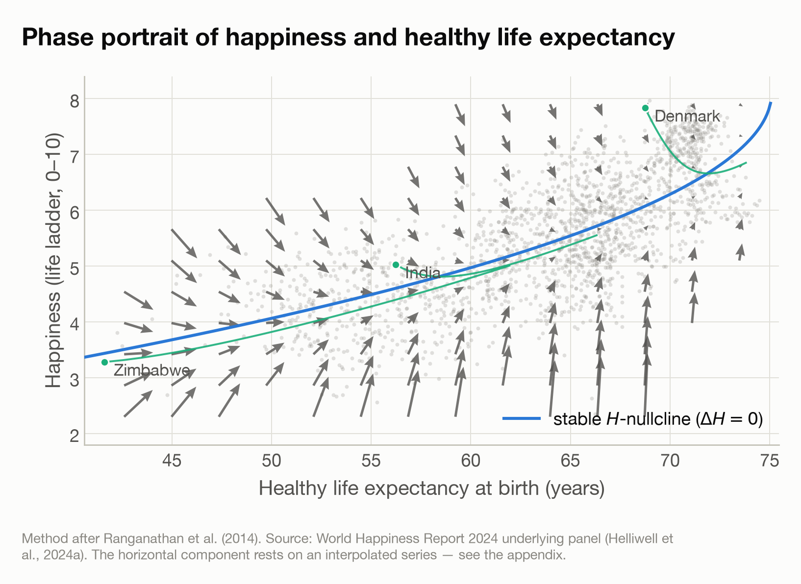

# Phase portrait of the two-variable system

Generated by `Code/09_phase_portrait.py`. Method after Ranganathan et al. (2014), whose Figure 5 plots democracy against log GDP per capita in the same way.

## The system

The two fitted models together define a dynamical system in the $(E, H)$ plane:

$$\Delta H = +0.4055 -0.3917\,H +0.0242\,H^2 +0.0158\,E$$

$$\Delta E = +4.6614 -0.1241\,E +0.000834\,E^2 +0.0089\,H$$

Coefficients are read from the JSON written by `07_sq3_growth.py` and `08_sq3b_life_expectancy.py`, so the figure cannot diverge from the fits reported in the appendix.

## Fixed point

The two curves do not cross within the observed data, so the system has no fixed point in the region the data covers. The best numerical residual was 0.105 at $E$ = 72.9, $H$ = 6.92.

## What the curve means

- The blue curve is the **stable branch of the $H$-nullcline**, where the happiness component of the vector field vanishes. Above it happiness falls, below it rises, so trajectories are drawn to it *vertically*. It is the same relationship reported as the implied equilibrium in sub-question 3, which is an equilibrium of the happiness equation at a **fixed** healthy life expectancy.
- **It is not a curve on which happiness is unchanging.** A state sitting on it is only momentarily stationary in $H$. Because $\Delta E > 0$ the state moves rightward, and because the curve rises with $E$ the state is then below it, so happiness resumes climbing. Motion along the nullcline is driven entirely by the change in healthy life expectancy — which is the component resting on an interpolated series.
- **There is no health-unchanging curve.** On this fit $\Delta E$ is positive at every point in the observed range — its minimum over the observed points is +0.09 years per year, at $E \approx 74$ — so healthy life expectancy never stops rising anywhere in the figure, and the curve is not drawn. That is exactly the behaviour a monotonically interpolated series produces, and it is the reason the system has no fixed point: the arrows always drift rightward.

## What is trustworthy in this figure

**The vertical flow is the result. The horizontal flow is largely an artefact.**

- Vertical movement is the change in happiness — a survey measure that genuinely varies year to year, with 96% of its variance within countries.
- Horizontal movement is the change in healthy life expectancy, which the source interpolates. It takes 152 distinct values across 1,874 country-years and 68% of its variance lies between countries. The arrows therefore drift rightward at a rate set mostly by how the series was constructed, not by anything happening in those countries.

The consequence for the trajectories is direct: their vertical path carries meaning, their horizontal path carries the interpolation. A reader should take them as an illustration of the fitted system, not a forecast.

## Figure

*Arrows are one year of expected movement. Because the axes carry different units, the angle shows the direction of travel on the figure rather than a ratio of years to ladder points.*

## Reference

Ranganathan, S., Spaiser, V., Mann, R. P., & Sumpter, D. J. T. (2014). Bayesian dynamical systems modelling in the social sciences. *PLoS ONE*, 9(1), e86468. [https://doi.org/10.1371/journal.pone.0086468](https://doi.org/10.1371/journal.pone.0086468)
