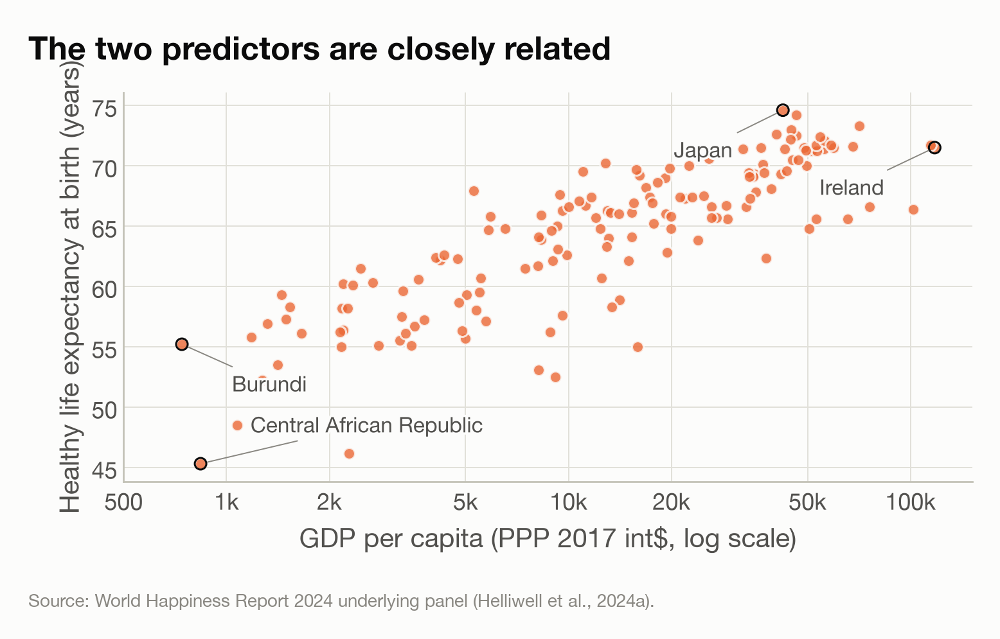
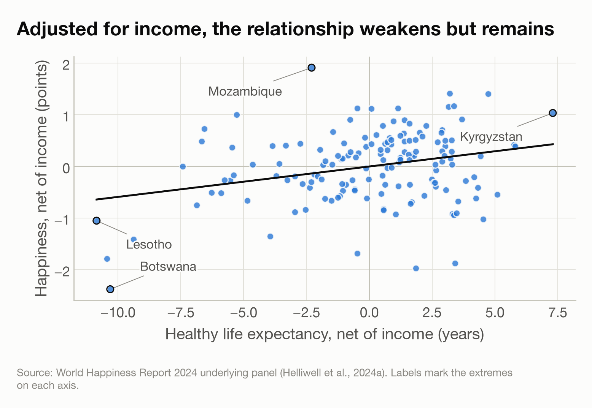

# Sub-question 2 — does the association survive accounting for income?

Generated by `Code/06_sq2_income.py`. Sample option (a), as agreed: the sub-question 1 cross-section reduced to rows that also carry income, with every country at the same year it had there.

## Sample

- **152 countries**, down from 160 in sub-question 1.
- Dropped for having no income figure: 8 — Afghanistan, Cyprus, Libya, Malta, Singapore, South Sudan, Venezuela, Yemen.
- Venezuela's absence is a consequence of the cleaning decision: its GDP series was set to missing in full.

## First, how separable are the two predictors?

Pearson correlation between log GDP per capita and healthy life expectancy: **r = 0.835** (r² = 0.70).

*Healthy life expectancy against income across the same countries.*

This matters more than the fit itself. The more closely the two move together, the less the data can say about which of them the ladder tracks, and the more any split between them is a property of the specification rather than of the world.

## The fits

| model                            |   n | HLE per decade       | log GDP coefficient     |    R² |
|:---------------------------------|----:|:---------------------|:------------------------|------:|
| A — healthy life expectancy only | 152 | +1.42 [+1.22, +1.61] | —                       | 0.575 |
| B — plus log GDP per capita      | 152 | +0.59 [+0.18, +1.00] | +0.507 [+0.318, +0.696] | 0.659 |
| income only, for symmetry        | 152 | —                    | +0.759 [+0.674, +0.844] | 0.629 |

Intervals are 95% and HC3-robust. For reference, the sub-question 1 slope on the full 160-country sample was +1.47, so reducing the sample by 8 country moved it to +1.42 before income was added at all.

### What happens to the healthy-life-expectancy slope

- Before adjustment (same sample): **+1.42** ladder points per decade.
- After adjustment: **+0.59** (95% CI +0.18 to +1.00).
- **42% of the slope survives**, and the interval excludes zero.
- R² rises from 0.575 to 0.659, an increase of 0.085.
- Income alone reaches R² = 0.629, above healthy life expectancy alone at 0.575.

### Collinearity diagnostics

| predictor                        |   VIF |
|:---------------------------------|------:|
| Healthy life expectancy at birth |  3.31 |
| Log GDP per capita               |  3.31 |

- A VIF of 3.31 means that predictor's standard error is 1.82× wider than it would be if the two were unrelated.
- Conventional thresholds put 5 as a concern and 10 as serious. The values here are moderate, so the two coefficients are separable — but not sharply.

## Added-variable plot

*Both variables residualised on log GDP per capita: what is left of Figure 1 once income is removed from each. The slope of this plot is exactly the partial coefficient from model B.*

## What this does and does not establish

- The partial coefficient answers a narrow question: **among countries with similar income, do those with longer healthy lives report higher ladder scores?** It is not a claim that healthy life expectancy matters independently of income in any causal sense.
- **Adjusting for income is not a neutral operation here.** Income and health are both partly produced by the same development processes, so income is not a confounder sitting outside the relationship. Removing it may remove part of the pathway by which longer healthy lives arise, which would make the adjusted slope an *under*-statement rather than a correction.
- **Measurement error still attenuates.** Healthy life expectancy is partly interpolated, so its coefficient remains a lower bound — and in a multivariable fit, error in one predictor can bias the other's coefficient in either direction.
- Unequal spread, non-independent countries and the mixed-year cross-section all carry over from sub-question 1.
