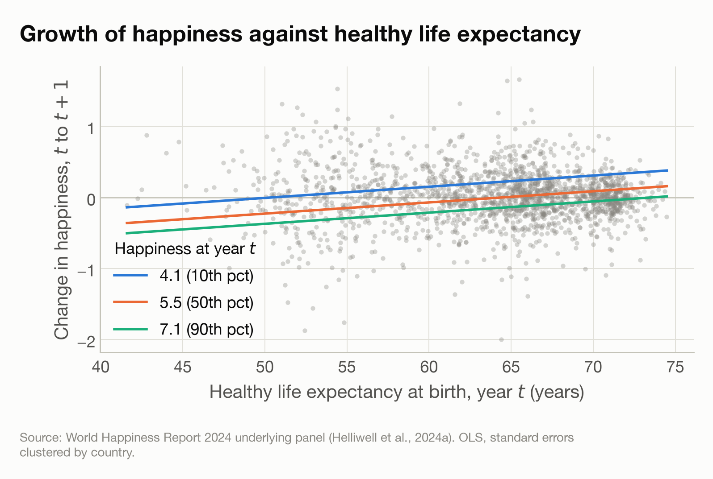
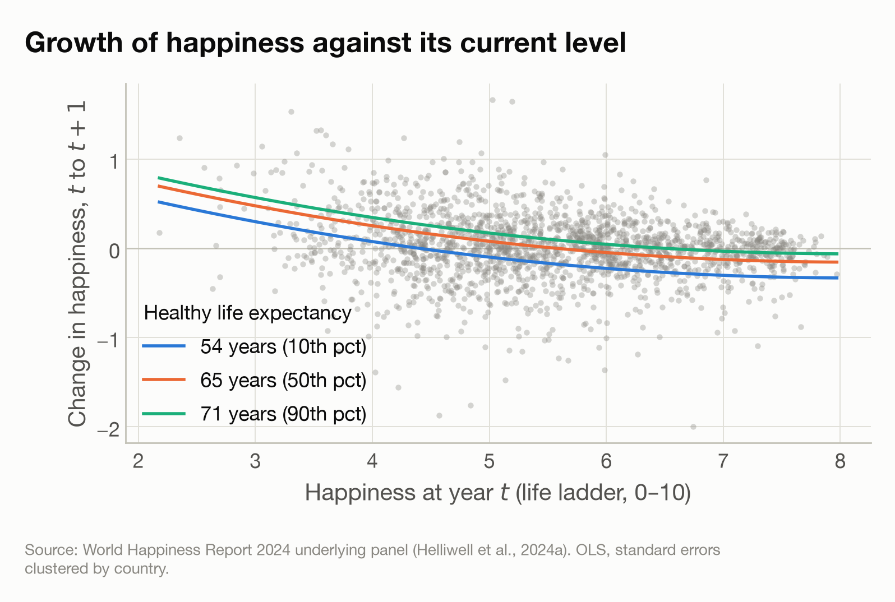

# Sub-question 3 — the growth of happiness

**Year to year within countries, does the growth rate of happiness depend on healthy life expectancy, and does it slow as happiness rises?**

Generated by `Code/07_sq3_growth.py`. Notation: $H$ is happiness, the national average life ladder; $E$ is healthy life expectancy at birth in years.

## The paired sample

Every pair of consecutive **calendar** years in which the life ladder, log GDP per capita and healthy life expectancy are all present in both years. Consecutive rows would not do: countries have gaps, so the year numbers must differ by exactly one.

- **1,872 pairs**, from **151 countries**.
- Start years 2007–2022.
- Pairs per country: min 1, median 14, max 16.
- Income is required for selection although this model does not use it, so that adding income later cannot change the sample.

- Change in happiness, $\Delta H$: mean +0.0146, SD 0.3744, range -2.00 to +1.66.
- $H_t$: 2.18 to 7.97. $E_t$: 41.6 to 74.5 years.

Note that **pairs overlap**: each year is the end of one pair and the start of the next, so the errors are serially correlated within a country. Standard errors are clustered by country throughout.

|   Start year |   Pairs |
|-------------:|--------:|
|         2007 |      82 |
|         2008 |      82 |
|         2009 |      99 |
|         2010 |     115 |
|         2011 |     126 |
|         2012 |     125 |
|         2013 |     126 |
|         2014 |     129 |
|         2015 |     131 |
|         2016 |     134 |
|         2017 |     132 |
|         2018 |     132 |
|         2019 |     110 |
|         2020 |     109 |
|         2021 |     115 |
|         2022 |     125 |

## The model

$$\Delta H = k + a_0 H_t + a_1 H_t^2 + a_2 E_t + \varepsilon$$

| term            |   estimate |   95% low |   95% high |        p |
|:----------------|-----------:|----------:|-----------:|---------:|
| $k$ (constant)  |    0.40553 |   0.00115 |    0.80991 | 0.0494   |
| $a_0$ — $H_t$   |   -0.39174 |  -0.54554 |   -0.23793 | 5.98e-07 |
| $a_1$ — $H_t^2$ |    0.02415 |   0.01134 |    0.03696 | 0.00022  |
| $a_2$ — $E_t$   |    0.01575 |   0.01145 |    0.02005 | 6.99e-13 |

- n = 1,872 pairs, clustered on 151 countries. R² = 0.0715.
- Residual SD 0.3610 against an outcome SD of 0.3744.
- Joint test that $a_0 = a_1 = a_2 = 0$: F = 26.30, p = 1e-13.

### What each term adds

| model          |     R² |
|:---------------|-------:|
| constant only  | 0      |
| + $H_t$        | 0.0321 |
| + $H_t^2$      | 0.0382 |
| + $E_t$ (full) | 0.0715 |

R² is low throughout, which is expected: year-on-year change in a national survey mean is mostly noise, and the question is whether any systematic part of it tracks happiness and healthy life expectancy — not whether the model predicts individual changes well.

Note the sign of $a_1$ is positive, which does **not** mean growth accelerates with happiness. The slope of the growth curve is $a_0 + 2a_1 H$, which is negative across the whole observed range of $H$ (-0.286 at the lowest, -0.007 at the highest); the positive $a_1$ only means the slowing is slightly less steep at high levels.

### Collinearity

| term    |   VIF |
|:--------|------:|
| $H_t$   |  78.2 |
| $H_t^2$ |  75.8 |
| $E_t$   |   2.1 |

$H$ and $H^2$ are necessarily collinear, being functions of the same variable, so their individual coefficients are imprecise and are best read together as the shape of the growth curve. $E$ now enters on its own rather than multiplied by $H$, so its coefficient is far better identified than in the superseded interaction form, where every regressor was a function of the same two variables.

## Implied equilibrium

Setting $\Delta H = 0$ at the median healthy life expectancy (65.2 years) gives roots at $H$ = 10.64, 5.57.
- Stable root: **$H^*$ = 5.57**, against an observed range of 2.18–7.97.
- Long-run response of happiness to healthy life expectancy there: **+1.29 points per decade**, against **+1.47** measured across countries in sub-question 1.

|   $E$ (years) |   stable $H^*$ |   d$H^*$/d$E$ per decade |
|--------------:|---------------:|-------------------------:|
|          54   |           4.4  |                     0.88 |
|          65.2 |           5.57 |                     1.29 |
|          71.1 |           6.5  |                     2.02 |

The long-run response still varies with the level, because the equilibrium condition remains quadratic in $H$ — but through $a_0 + 2a_1 H^*$ alone, not through $E$ as well.

### Where growth stops

Solving $\Delta H = 0$ for $E$ at a fixed level of happiness gives the healthy life expectancy at which the model predicts no further change — the zero crossings visible in the second figure below.

|   happiness $H$ | percentile   |   $E$ where growth stops (years) |
|----------------:|:-------------|---------------------------------:|
|             4.1 | 10th         |                             50.3 |
|             5.5 | 50th         |                             64.4 |
|             7.1 | 90th         |                             73.5 |

## Measurement error in $H_t$

$H_t$ appears on both sides of the equation: inside $\Delta H = H_{t+1} - H_t$ with a negative sign, and as a regressor with a positive one. Sampling error in the ladder therefore induces a *negative* correlation between the two, pushing $a_0$ downward whether or not growth genuinely slows as happiness rises. **Part of the strongly negative $a_0$ may be manufactured this way**, so the size of the bias matters.

This panel publishes no confidence intervals, so the ladder's sampling error cannot be read from the file. The table below therefore simulates it: fresh noise of a stated size is added to the ladder **once per country-year in the underlying panel**, the pairs are rebuilt from that noisy series, and the model refitted. Adding noise this way is what reproduces the mechanism — the same draw enters $\Delta H$ for one pair and the regressor for the next, exactly as real sampling error does. Adding independent noise to the regressor alone would test classical attenuation instead, which is a different and much milder problem.

|   assumed SE of ladder |    $k$ |   $a_0$ |   $a_1$ |   $a_2$ |
|-----------------------:|-------:|--------:|--------:|--------:|
|                   0    | 0.4055 | -0.3917 |  0.0242 | 0.01575 |
|                   0.05 | 0.3941 | -0.3946 |  0.0241 | 0.01621 |
|                   0.1  | 0.3575 | -0.4019 |  0.0238 | 0.01756 |
|                   0.15 | 0.3001 | -0.4146 |  0.0234 | 0.01975 |

Read this as a sensitivity check rather than a correction: it shows how far the estimates would move if the ladder carried that much noise, averaged over 40 draws per row. It does not establish how much noise the ladder actually carries.

## With year effects

| term            |   pooled |   with year effects |   95% low |   95% high |
|:----------------|---------:|--------------------:|----------:|-----------:|
| $a_0$ — $H_t$   | -0.39174 |            -0.38215 |  -0.53682 |   -0.22747 |
| $a_1$ — $H_t^2$ |  0.02415 |             0.02341 |   0.01059 |    0.03624 |
| $a_2$ — $E_t$   |  0.01575 |             0.01561 |   0.01121 |    0.02002 |

Year effects absorb anything that moved global happiness in a given year — the pandemic being the obvious case. If the coefficients hold up, the result is not an artefact of a common time pattern.

## Figures

**Used in the report** — growth against healthy life expectancy, lines by level of happiness.

*At a fixed level of happiness the model is linear in healthy life expectancy, so these are parallel straight lines with slope $a_2$.*

**Alternative, not used** — growth against happiness, curves by healthy life expectancy.

*Curves slope downward: growth slows as happiness rises. With $E$ additive the three curves are vertical shifts of one another, and where each crosses zero is the equilibrium level at that healthy life expectancy.*

## Output

`outputs/consecutive_pairs.csv` — 1,872 rows, the paired sample.
