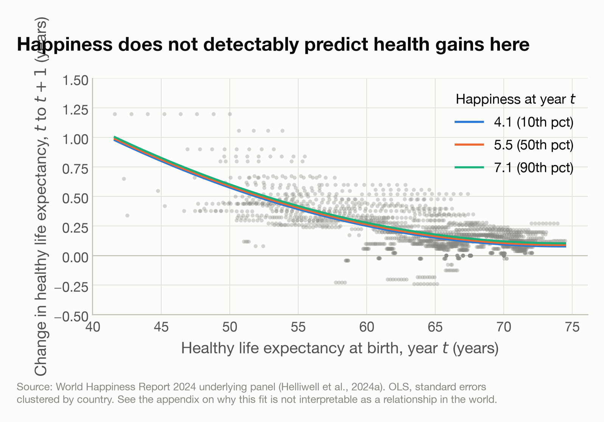

# Sub-question 3, second model — the growth of healthy life expectancy

$$\Delta E = k + a_1 E_t + a_2 E_t^2 + a_3 H_t + \varepsilon$$

Generated by `Code/08_sq3b_life_expectancy.py`. The mirror of the happiness-growth model: it asks whether happiness predicts how fast healthy life expectancy rises, which is the reverse direction of sub-question 1.

## First: is $\Delta E$ a measurement?

This has to come before any coefficient, because the answer determines what a coefficient could mean. WHR interpolates and extrapolates healthy life expectancy across the whole period, and differencing an interpolation returns its slope, not a measured change.

- $\Delta E$ takes only **151 distinct values across 1,872 country-years**.
- Per country, the median is **4 distinct values** across a median of 14 pairs. **72 of 151 countries** have three or fewer.
- **83% of the variance in $\Delta E$ is between countries** rather than within them — it is close to a country-specific constant. For $\Delta H$ the same figure is 4%, so happiness genuinely moves from year to year and healthy life expectancy, as recorded here, does not.

The series themselves make it plainest:

| country   | $\Delta E$, year by year                                                                        |
|:----------|:------------------------------------------------------------------------------------------------|
| Japan     | +0.12 +0.12 +0.12 +0.12 +0.12 +0.12 +0.12 +0.12 +0.12 +0.12 +0.12 +0.12 +0.12 +0.12 +0.12 +0.12 |
| Brazil    | +0.16 +0.16 +0.16 +0.16 +0.16 +0.16 +0.16 +0.16 +0.18 +0.18 +0.17 +0.18 +0.17 +0.18 +0.18 +0.17 |
| Kenya     | +0.52 +0.52 +0.52 +0.52 +0.52 +0.52 +0.52 +0.52 +0.40 +0.40 +0.40 +0.40 +0.40 +0.40 +0.40 +0.40 |

Japan gains exactly 0.12 years of healthy life every year for sixteen years. Kenya gains exactly 0.52 for eight years and then exactly 0.40 for eight more. These are the gradients of straight lines drawn between anchor points, not annual observations.

## The fit, as requested

| term            |   estimate |   95% low |   95% high |        p |
|:----------------|-----------:|----------:|-----------:|---------:|
| $k$ (constant)  |   4.66141  |  2.595    |   6.72782  | 9.81e-06 |
| $a_1$ — $E_t$   |  -0.124133 | -0.189962 |  -0.058303 | 0.000219 |
| $a_2$ — $E_t^2$ |   0.000834 |  0.00031  |   0.001357 | 0.0018   |
| $a_3$ — $H_t$   |   0.008896 | -0.021614 |   0.039406 | 0.568    |

- n = 1,872 pairs, clustered on 151 countries. R² = 0.3826.
- Joint test that $a_1 = a_2 = a_3 = 0$: F = 52.39, p = 3.19e-23.

Taken at face value, $a_3$ is **+0.0089** years of healthy life per year, per point of happiness (95% CI -0.0216 to +0.0394) — positive, with an interval that includes zero.

## How to read the null

The R² of 0.38 is not evidence of a good model. It comes almost entirely from $E$ and $E^2$, which track the interpolation's own structure. Happiness adds essentially nothing.

**The null on $a_3$ is uninformative, not reassuring.** It should not be read as evidence that happiness does not lengthen healthy life. An outcome that is 83% country-constant carries very little year-on-year signal for anything to predict, so the test has little power to detect a real effect. Absence of evidence here is close to absence of a measurement.

Three specific problems, any one of which would be enough to withhold a conclusion:

1. **The outcome barely varies within a country.** With 83% of its variance between countries, this is close to a cross-sectional regression of a country's average interpolated gain on its happiness level, even though the specification is dynamic. It does not use the year-on-year information the specification appears to use.
2. **Serial dependence is extreme, not merely present.** A country repeating one value for eight years contributes eight rows carrying the information of one. Clustering by country widens the intervals correctly for that, but it cannot recover information the data does not hold.
3. **Direction would not be identified even with a clean outcome.** Happier countries are richer, better governed and better served medically. Nothing here separates happiness from what accompanies it.

**On the apparent asymmetry.** Healthy life expectancy predicts the growth of happiness, while happiness does not detectably predict the growth of healthy life expectancy. The asymmetry follows from **which variable each model has to predict**, not from any asymmetry in the world.

- The first model's outcome is the change in happiness, a survey measurement: 4% of its variance lies between countries, so 96% lies within them.
- The second model's outcome is the change in healthy life expectancy, which the source interpolates: 83% of its variance lies between countries, leaving 17% within, and it takes 151 distinct values across 1,872 country-years.

An outcome that is close to a per-country constant cannot be predicted by any regressor. The second model would return a null whether or not happiness lengthens healthy life, so the two results cannot be compared as though both tests were equally able to detect an effect.

The two R² values invite the same mistake in reverse: 0.38 here against 0.07 for the happiness model makes this one look better specified, when its R² comes almost entirely from $E$ and $E^2$ tracing the interpolation's own structure.

The corresponding model for happiness does not share this defect: there the interpolated variable sits on the right-hand side as a level, and the outcome is the survey measure, which genuinely moves.

## Figure

*The horizontal runs of points are the interpolation showing through: a country contributes the same value year after year. The fitted lines are the model above.*

The vertical axis is limited to -0.5 to 1.5 years, which excludes **5 of 1,872 points** (0.3%) — 5 (Syria). Without the limit those few points stretch the axis to ±5 years and compress everything else into an unreadable band. Both sets are themselves interpolation: the source steps Syria down by exactly 1.76 years annually, and Haiti up by exactly 5.32.

| Country   |   Start year |   $\Delta E$ |
|:----------|-------------:|-------------:|
| Syria     |         2008 |        -1.76 |
| Syria     |         2009 |        -1.76 |
| Syria     |         2010 |        -1.76 |
| Syria     |         2011 |        -1.76 |
| Syria     |         2012 |        -1.76 |

