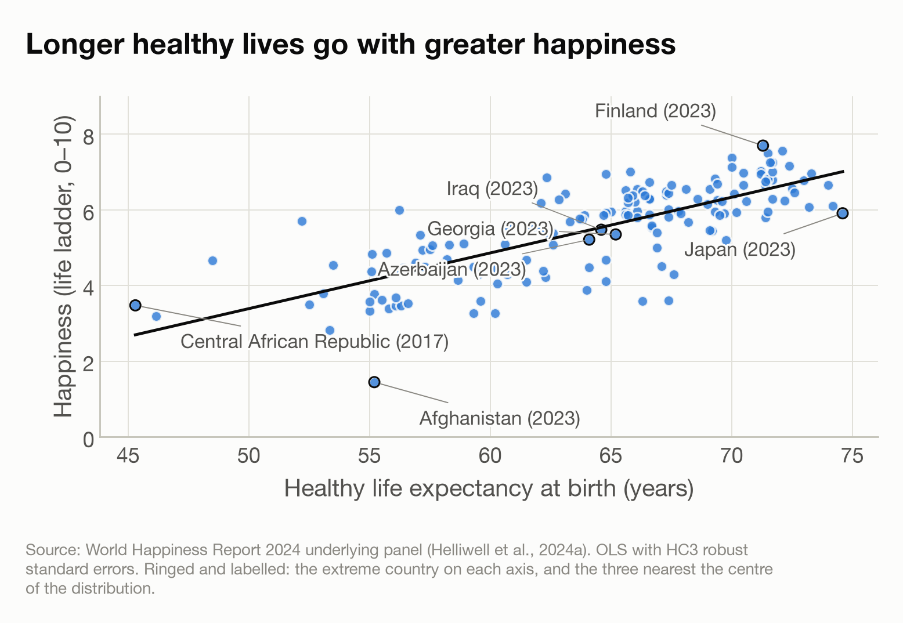

# Investigating the dynamics of health and happiness at a country level

## Abstract

National differences in how people rate their own lives are large, and income accounts for much but not all of those differences. Deaton (2008), analysing the Gallup World Poll that underlies the World Happiness Report, found that the level of life expectancy had no apparent effect on life evaluations once income was allowed for, although changes in life expectancy did appear to raise them. We look again at this question, focussing on whether life expectancy affects year-to-year changes in happiness. We take a dynamical systems approach to presenting how happiness grows over time across countries. We find that countries whose populations live longer do report higher life evaluations, and about half of that association remains once income is accounted for. Between years, happiness moves toward a level that rises with healthy life expectancy. Conversely, happiness does not predict the growth of healthy life expectancy, although the data proves insufficient to establish an association. The sequence we observe is thus consistent with health leading happiness at a country level.

## Introduction

Whether people in healthier countries rate their lives more highly is not a settled question. Among individuals the association between health and wellbeing is well established and runs in both directions: reviews of prospective studies argue that subjective wellbeing itself contributes to health and longevity rather than merely following from illness, while cautioning that confounding and reverse causation remain the central difficulties and that observational work cannot settle them (Diener & Chan, 2011; Steptoe, 2019). Across countries the evidence is thinner and more awkward. National life evaluations rise with income, strongly and with no evident satiation point (Stevenson & Wolfers, 2008), and it is the evaluative judgement rather than everyday emotional experience that income tracks (Kahneman & Deaton, 2010). But when the Gallup World Poll was first examined against objective measures of health, life expectancy explained almost nothing: conditional on income its level had no apparent effect on life satisfaction, and only changes in it did (Deaton, 2008). Whether that pattern holds in the longer panel now available, whether any association survives adjustment for income given how closely health and income travel together, and whether the year-to-year record can say anything about which of them moves first, are the questions we take up here.

One way of measuring happiness is to use the national average Cantril ladder score (Cantril, 1965), where respondents place their life on a 0–10 scale running from the worst to the best possible life for them. Healthy life expectancy is expected years lived in good health at birth, derived from World Health Organization estimates (World Health Organization, n.d.). Both are drawn from the underlying panel of the *World Happiness Report 2024* (Helliwell et al., 2024a), which combines Gallup World Poll survey responses (Gallup, n.d.) with statistical series from other sources and covers 164 countries annually from 2007 to 2023. Variable definitions follow the report's own statistical appendix (Helliwell et al., 2024b).

The questions we look at here are primarily of association rather than cause. Countries are not assigned life expectancies at random, and wellbeing is itself associated with health and longevity. Nor is the data about individuals, so we can't say how personal happiness is impacted by health. We can ask, however, whether a change in one follows the level of the other. That question is in the spirit of Granger causality (Granger, 1969), which asks whether the past of one series improves the prediction of another beyond the second's own past. We also treat the two variables as a dynamical system and plot the direction of movement in the plane they span, following the approach Ranganathan et al. (2014) take to democracy and income.

Three sub-questions were set before any analysis was carried out:

1. Across countries, is higher healthy life expectancy associated with higher life-ladder scores?
2. Does that association survive accounting for income?
3. Year to year within countries, does the growth rate of happiness depend on healthy life expectancy, and does it slow as happiness rises?

We now answer these questions in turn.

## Methods

### Data

The analysis uses the World Happiness Report's panel of raw underlying variables (Helliwell et al., 2024a), which reports each measure in its own units rather than as a modelled contribution. Coverage was restricted to 2007–2023, the years in which the panel runs at 102 or more countries and 86–93% complete. Two known defects in the source — Haiti's healthy life expectancy for 2008–2012 and Venezuela's GDP series — were set to missing rather than corrected. No values were imputed anywhere: gaps are left as gaps, and where a variable is systematically absent the excluded countries are named. Full provenance, scope and cleaning decisions are in [Appendix.md](Happiness%20Appendix.md#data-summary).

Both sub-questions are answered on a cross-section of one row per country, at its most recent year in which the variables required are present. This is not a single-year snapshot: 135 of the 160 countries contribute 2023 and 25 contribute an earlier year, back to 2007. Countries whose coverage stops early were retained rather than dropped, because they are not a random subset — coverage tends to end where there is instability, so excluding them would bias the cross-section toward countries stable enough to keep being surveyed.

### Sub-question 1: across countries

Happiness was regressed on healthy life expectancy by ordinary least squares across the 160 countries carrying both measures. Standard errors are heteroscedasticity-robust (HC3), because the vertical spread of the scatter is visibly wider at high healthy life expectancy than at low. The slope is reported per decade so that its size is interpretable against the ladder's own 0–10 scale.

Ordinary least squares does not assume the underlying relationship is linear; it estimates the best straight-line approximation to whatever shape is present. Spearman's rank correlation is reported alongside as a check that assumes no functional form at all. Robustness was checked by refitting on reduced samples chosen in advance rather than after seeing which exclusion helped. Full diagnostics are in [Appendix.md](Happiness%20Appendix.md#step-4-the-fit).

### Sub-question 2: accounting for income

Income is measured as log GDP per capita, so that equal increments represent equal proportional differences in income. The sample is the sub-question 1 cross-section reduced to the 152 countries that also carry an income figure. The healthy-life-expectancy-only model was refitted on these 152 countries, so that the before-and-after comparison reflects the addition of income rather than the change of sample. Two nested models were then fitted, both with HC3 robust standard errors: happiness on healthy life expectancy alone, and on healthy life expectancy together with log GDP per capita. A third model with income alone is reported for symmetry, so that neither predictor is implicitly treated as the explanation and the other as a control.

Collinearity between the two predictors was assessed before the fits rather than after, so that how far they can be separated at all is established before any apportionment between them is read.

### Sub-question 3: the growth of happiness

This sub-question uses the full panel rather than a cross-section. The sample is every pair of consecutive calendar years in which the life ladder, log GDP per capita and healthy life expectancy are all present in both years — 1,872 pairs from 151 countries. Consecutive rows would not suffice, because countries have gaps in coverage, so the year numbers must differ by exactly one. Income is required for selection although this model does not use it, so that adding income later cannot change the sample.

The model is

$$\Delta H \;=\; k + a_0 H_t + a_1 H_t^2 + a_2 E_t + \varepsilon$$

where $H$ is happiness — the national average life ladder — and $E$ is healthy life expectancy in years. It is fitted by ordinary least squares on the change in happiness. Growth is allowed to depend on the current level of happiness, quadratically, and on healthy life expectancy additively, so the effect of healthy life expectancy on growth is the same at every level of happiness rather than being assumed to scale with it. The constant $k$ admits growth that does not scale with the level at all. Standard errors are clustered by country, because consecutive pairs overlap — each year ends one pair and begins the next — so the errors are serially correlated within a country. The model is pooled, with no country fixed effects. 

Setting $\Delta H = 0$ gives the level at which happiness would settle. With $k$ present this condition is quadratic in $H$, so the relevant root is the stable one, and the implied long-run response of happiness to healthy life expectancy varies with the level rather than being a single number. It is therefore reported at stated values of healthy life expectancy.

A further model was fitted on the same pairs to test whether happiness predicts how fast healthy life expectancy rises:

$$\Delta E \;=\; k + a_1 E_t + a_2 E_t^2 + a_3 H_t + \varepsilon$$

Taken together the two models define a dynamical system in the plane of healthy life expectancy and happiness: at any point, the pair $(\Delta E, \Delta H)$ gives the direction and magnitude of one year's expected movement. Drawing that vector on a grid is a phase portrait, following Ranganathan et al. (2014), who use the same construction to plot democracy against log GDP per capita. The curve on which $\Delta H = 0$ — the stable branch of the happiness nullcline — divides the plane into a region where happiness rises and one where it falls. It is not a curve of stasis: a state on it is only momentarily stationary in happiness, because $\Delta E$ remains positive and carries the state rightward. Trajectories integrate the system forward in annual steps from observed starting positions. Arrow components are plotted in data units, so the angle on the page shows movement as a fraction of each plotted axis rather than a ratio of years to ladder points; arrows are drawn only over the region the data occupies, because the quadratics extrapolate steeply outside it.

This second model carries a defect the first does not, and it was checked before the fit rather than after. Its outcome is the year-on-year change in healthy life expectancy, and the source interpolates that series across the period, so differencing it returns the gradient of an interpolation rather than a measured change. $\Delta E$ takes only 151 distinct values across 1,872 country-years, 83% of its variance lies between countries rather than within them, and 72 of 151 countries have three or fewer distinct values — Japan gains exactly 0.12 years of healthy life in each of sixteen consecutive years. The fit is reported for completeness, and read accordingly.

## Results

### Sub-question 1: across countries

Across the 160 countries with both measures, higher healthy life expectancy is associated with greater happiness. Each additional decade of healthy life expectancy corresponds to +1.47 ladder points (95% CI +1.26 to +1.68), and the fitted line accounts for 59% of the cross-country variance in ladder scores (Figure 1). Spearman's rank correlation, ρ = 0.77, gives the same answer without assuming any functional form. The estimate is stable under influence checks: +1.43 excluding Afghanistan, the largest outlier, and +1.56 excluding the countries below 50 years of healthy life expectancy. Because healthy life expectancy is partly interpolated by the source, measurement error in the predictor attenuates the slope, so +1.47 is a lower bound on the association.

<small><b>Figure 1.</b> Life ladder against healthy life expectancy at birth, one point per country at its most recent year in which both were recorded (n = 160). Ladder scores span 1.45 to 7.70 and healthy life expectancy 45.3 to 74.6 years. Line fitted by ordinary least squares with heteroscedasticity-robust (HC3) standard errors. Ringed points, each with a leader line to its label, are the extreme country on each axis and the three countries nearest the centre of the distribution.</small>

### Sub-question 2: accounting for income

On the 152 countries that also carry an income figure, healthy life expectancy alone gives +1.42 ladder points per decade; adding log GDP per capita reduces this to +0.59 (95% CI +0.18 to +1.00), so about two-fifths of the slope remains and the interval excludes zero. Income and healthy life expectancy are closely related to each other (r = 0.84), which is why their separate contributions cannot be divided sharply: income alone accounts for more of the cross-country variance (R² = 0.63) than healthy life expectancy alone (R² = 0.58), and together they reach R² = 0.66. The adjusted estimate answers a narrower question than the unadjusted one: among countries of similar income, a decade more healthy life expectancy corresponds to about half a ladder point.

### Sub-question 3: the growth of happiness

Happiness grows more slowly the higher it already is. The fitted curve in Figure 2 slopes downward across the whole observed range and crosses zero at the level where happiness stops changing, so a country below that level moves up toward it and a country above it falls back. The curve sits higher where healthy life expectancy is greater: each additional year is associated with +0.016 ladder points of annual growth, with a 95% confidence interval from +0.011 to +0.020. The level where growth stops therefore rises with healthy life expectancy — 4.4 ladder points at 54 years, 5.6 at the median of 65, and 6.5 at 71 — a response of +1.29 points per decade, against the +1.47 measured directly across countries in sub-question 1. The three terms are jointly significant (p = 1 × 10⁻¹³) across 1,872 consecutive-year pairs from 151 countries, and the model accounts for 7% of the variance in individual year-on-year changes.

<small><b>Figure 2.</b> Change in happiness from one year to the next, against happiness at the start of the pair, over the 1,872 observed year-on-year changes in grey. Curves are the fitted model at the 10th, 50th and 90th percentile of healthy life expectancy: 54, 65 and 71 years. Healthy life expectancy enters the model additively, so the three curves are vertical shifts of one another. The curve crosses zero where the model predicts no further change in happiness.</small>

Figure 2 is read as follows. Each grey point is one country in one year: how happy it was, and how far its happiness moved over the following twelve months. Points above the zero line are countries that got happier, points below are countries that got less happy. The three curves are what the model predicts for a country with low, middling or high healthy life expectancy. That they slope downward is the first result: wherever a country starts, the higher its happiness the less it gained over the year. That they sit in ascending order is the second: at any given level of happiness, a country whose people live longer in good health gained more. They are vertical shifts of one another because the model gives healthy life expectancy the same effect at every level of happiness, rather than letting it vary. Where a curve crosses zero the two effects cancel and the model predicts no further change, which is the resting level given above.

Happiness does not detectably predict the growth of healthy life expectancy: $a_3$ = +0.009 years per year per point of happiness, with a 95% confidence interval from −0.022 to +0.039 (Figure 3). However, as discussed in the methods, because the source interpolates healthy life expectancy, its year-on-year change is close to a country-level constant: it takes 151 distinct values across the 1,872 country-years, and 83% of its variance falls between countries rather than within them. As such, the asymmetry between the two models cannot separate the direction of causation, because it follows from which variable each model has to predict. The change in happiness is a survey measurement and varies year to year, with 96% of its variance falling within countries; the change in healthy life expectancy is close to a per-country constant, with 17% within. 

<small><b>Figure 3.</b> Change in healthy life expectancy from one year to the next, against its level at the start of the pair, with lines at the 10th, 50th and 90th percentile of happiness. The three lines nearly coincide. The flat horizontal runs of points are the source's interpolation showing through: most countries repeat a single value for years at a time. The vertical axis is limited to −0.5 to +1.5 years, which excludes 5 of the 1,872 points, all of them Syria, a series the source moves in exact constant annual steps.</small>

Figure 4 puts the two models together as one system. Happiness is drawn vertically toward the blue curve, the stable branch of its nullcline, where the change in happiness vanishes: above the curve happiness falls, below it rises. Because healthy life expectancy keeps rising, the state slides rightward along the curve. The curve itself rises with healthy life expectancy, so happiness climbs as it goes. The system has no fixed point: the fitted $\Delta E$ has no zero anywhere in range, its minimum being about +0.09 years per year, which follows from the source's interpolation of that series rather than from anything measured in those countries.

<small><b>Figure 4.</b> Phase portrait of the two fitted models, after Ranganathan et al. (2014). Arrows give one year of expected movement, magnified twice, drawn only where the data lies. The blue curve is the stable branch of the happiness nullcline, where the change in happiness vanishes: above it happiness falls, below it rises. A state on the curve is only momentarily stationary, since rising healthy life expectancy carries it rightward. Green paths integrate the system forward 45 years from the first observed position of three countries. Grey points are the observed country-years. The horizontal component rests on an interpolated series and should not be read as measured movement.</small>

## Discussion

Countries whose populations live longer in good health report higher life evaluations, and this holds even when income is accounted for. A decade of additional healthy life expectancy corresponds to 1.47 ladder points (on a scale of 0 to 10) across the 160 countries measured. Adding income reduces that to 0.59 points per decade. The two predictors are strongly correlated, so we can't say too much about which is more important. These results agree with how Helliwell, Huang, Shiplett and Wang (2024, p. 22) describe their own six-factor model, in which the variables may be taking credit that properly belongs to other variables or to unmeasured factors. 

Helliwell, Huang, Shiplett and Wang also expect "vicious or virtuous circles, with two-way linkages among the variables", pointing to evidence that people with happier lives live longer, which then feeds back onto health, income and the other factors. We have investigated such changes by looking at what influenced the year-on-year change in happiness. We found that, in the absence of increases in life expectancy, happiness levels would stabilise at a level which depends on life expectancy. To see why this is the case, first consider the blue line in Figure 2, which shows that when life expectancy is 54, happiness will on average increase if it is below 4.4 and decrease if it is above, coming to rest at that point. When life expectancy is 65 (respectively 71) the resting point increases to 5.6 (respectively 6.5). The blue curve through Figure 4 then shows how this resting point depends on healthy life expectancy. According to this model, countries without increases in life expectancy will get "stuck" in terms of happiness. However, as Figure 3 shows, life expectancy is in general increasing, with the largest increases occurring where it is lowest, so happiness also increases for the 79 of 151 countries that currently sit below their resting point. The other 72, Denmark and Finland among them, are above it and fall back towards it. This is illustrated by the predicted trajectories of Zimbabwe, India and Denmark in Figure 4.

The fit of these models hides a lot of noise, and should at best be suggestive of a trend: the model accounts for only 7% of the variance in individual year-on-year changes. Moreover, at this point, we cannot say anything about the relationship between happiness levels and changes in life expectancy, because it is apparent from the regular rows of points in Figure 3, that the life expectancy data has been constructed by some form of linear interpolation. The primary reason that we see no effect of happiness on life expectancy is thus that the data is already constructed from a model, which our model then simply reproduces. The way the life expectancy data is constructed also means that the value recorded for one year is calculated partly from observations in later years, so these models fail a test of Granger causality (Granger, 1969). 

Taken together, what we can say is that health preceding happiness is consistent with this data, though not fully established by it. We cannot say anything about feedback in the other direction.

## Disclaimer

This report was written with the help of agentic AI at every stage: importing and describing the data, cleaning it, framing the questions, choosing and fitting the models, producing the figures, and drafting the text. Each step was directed and reviewed by the author, who agreed every method before it was applied, and each number reported here comes from code that can be re-run. The record of what was done, including what was tried and abandoned, is in [Happiness Appendix.md](Happiness%20Appendix.md).

## Appendix

The data and how it was prepared, the decisions taken and what each cost, the full workings behind every figure and estimate, and a guide to the analysis code are all in [Appendix.md](Happiness%20Appendix.md). The scripts themselves are in [Code/](Code/), and [Setup.md](../Setup.md) gives the commands needed to rebuild the environment and reproduce every number in this report.

## References

Cantril, H. (1965). *The Pattern of Human Concerns*. New Brunswick, NJ: Rutgers University Press. [https://archive.org/details/patternofhumanco0000cant](https://archive.org/details/patternofhumanco0000cant)

Deaton, A. (2008). Income, health, and well-being around the world: Evidence from the Gallup World Poll. *Journal of Economic Perspectives*, 22(2), 53–72. [https://doi.org/10.1257/jep.22.2.53](https://doi.org/10.1257/jep.22.2.53)

Diener, E., & Chan, M. Y. (2011). Happy people live longer: Subjective well-being contributes to health and longevity. *Applied Psychology: Health and Well-Being*, 3(1), 1–43. [https://doi.org/10.1111/j.1758-0854.2010.01045.x](https://doi.org/10.1111/j.1758-0854.2010.01045.x)

Gallup. (n.d.). *Gallup World Poll*. [https://www.gallup.com/analytics/318875/global-research.aspx](https://www.gallup.com/analytics/318875/global-research.aspx)

Granger, C. W. J. (1969). Investigating causal relations by econometric models and cross-spectral methods. *Econometrica*, 37(3), 424–438. [https://doi.org/10.2307/1912791](https://doi.org/10.2307/1912791)

Helliwell, J. F., Huang, H., Shiplett, H., & Wang, S. (2024). Happiness of the younger, the older, and those in between. In *World Happiness Report 2024* (pp. 9–60). University of Oxford: Wellbeing Research Centre. [https://doi.org/10.18724/whr-f1p2-qj33](https://doi.org/10.18724/whr-f1p2-qj33)

Helliwell, J. F., Layard, R., Sachs, J. D., De Neve, J.-E., Aknin, L. B., & Wang, S. (Eds.). (2024a). *World Happiness Report 2024*. University of Oxford: Wellbeing Research Centre. [https://www.worldhappiness.report/ed/2024/](https://www.worldhappiness.report/ed/2024/)

Helliwell, J. F., Layard, R., Sachs, J. D., De Neve, J.-E., Aknin, L. B., & Wang, S. (Eds.). (2024b). *Statistical appendix for Chapter 2*. In *World Happiness Report 2024*. University of Oxford: Wellbeing Research Centre. [https://files.worldhappiness.report/WHR24_Statistical_Appendix.pdf](https://files.worldhappiness.report/WHR24_Statistical_Appendix.pdf)

Kahneman, D., & Deaton, A. (2010). High income improves evaluation of life but not emotional well-being. *Proceedings of the National Academy of Sciences*, 107(38), 16489–16493. [https://doi.org/10.1073/pnas.1011492107](https://doi.org/10.1073/pnas.1011492107)

Ranganathan, S., Spaiser, V., Mann, R. P., & Sumpter, D. J. T. (2014). Bayesian dynamical systems modelling in the social sciences. *PLoS ONE*, 9(1), e86468. [https://doi.org/10.1371/journal.pone.0086468](https://doi.org/10.1371/journal.pone.0086468)

Steptoe, A. (2019). Happiness and health. *Annual Review of Public Health*, 40(1), 339–359. [https://doi.org/10.1146/annurev-publhealth-040218-044150](https://doi.org/10.1146/annurev-publhealth-040218-044150)

Stevenson, B., & Wolfers, J. (2008). Economic growth and subjective well-being: Reassessing the Easterlin paradox. *Brookings Papers on Economic Activity*, 2008(1), 1–87. [https://doi.org/10.1353/eca.0.0001](https://doi.org/10.1353/eca.0.0001)

World Health Organization. (n.d.). *Global Health Observatory*. [https://www.who.int/data/gho](https://www.who.int/data/gho)
